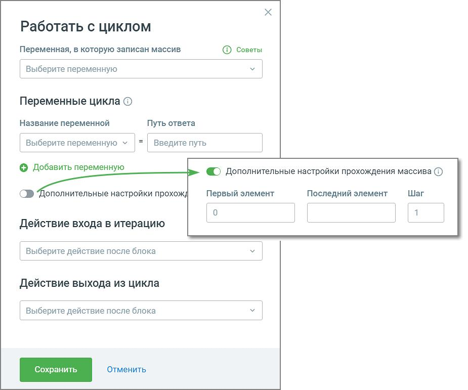
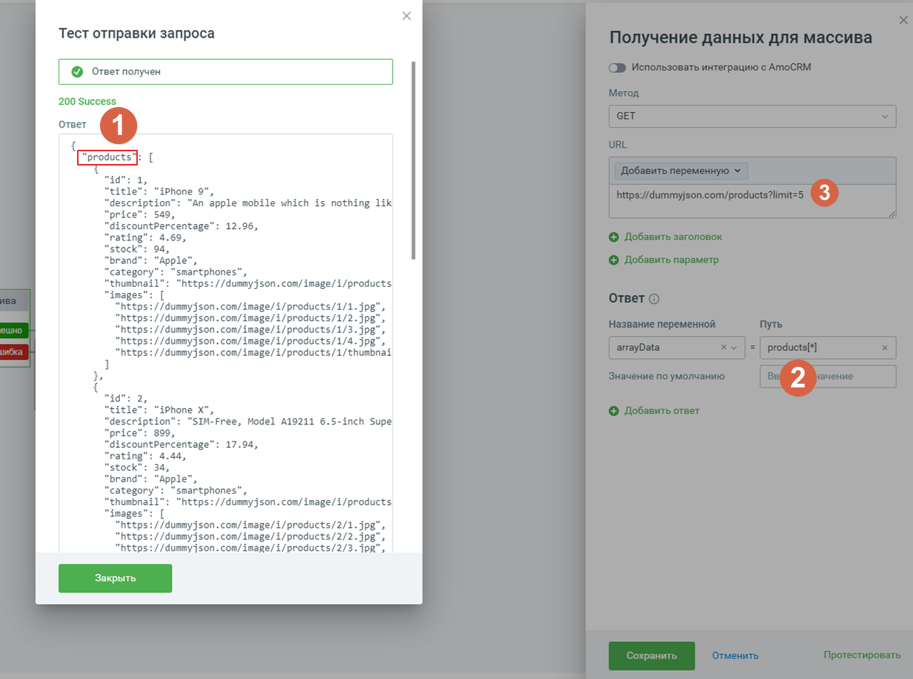
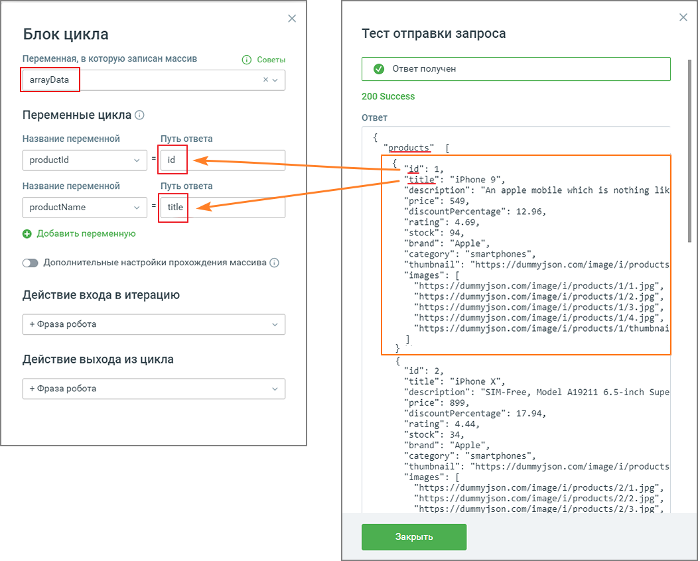
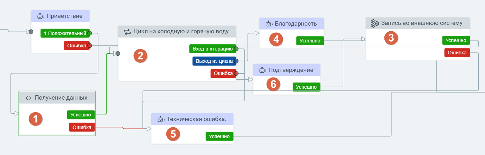

# 5.15. Блок Цикл

> Трассировка: PDF §5.15 · сквозные стр. 117-121 · источники: ч.1 `kb/sources/cov-robot-fil/Модуль ЦОВ Робот Фил 2,0_manual_v7.26.28.pdf` с.117-121.

Важно: Блок Цикл (обработка данных) всегда работает в связке с блоком Http-запрос (источник данных). Блок доступен при создании скрипта для Роботов, Роботов-администраторов и Чат-ботов. Использование в скрипте блока Цикл позволяет совершать повторяющиеся (цикличные) действия с массивом данных.

Элементы настроек блока: 1. Переменная, в которую записан массив – переменные Адресной книги, Исходящего обзвона и все пользовательские переменные скрипта. Клик по кнопке «Создать переменную» открывает поле для создания новой переменной скрипта. 2. Переменные цикла – переменные, значения в которых будут циклично обновляться по мере прохождения скрипта. Содержит Название переменной (объект массива) и Путь ответа (значение объекта массива). 3. Добавить переменную – выпадающий список всех доступных переменных модуля для вставки в тексте E-mail сообщения (поиск переменных без учета регистра). Допускается использование не более 10 переменных. В форме также доступно создание новой переменной скрипта. 4. Действие входа в итерацию – обработка одного элемента массива;

5. Действие выхода из итерации – выбор блока, к которому будет осуществлен переход после прохода цикла. Чтобы войти в следующую итерацию нужно после прохода цикла вернуться в начала блока цикла, и тогда начнется обработка следующего элемента массива. Пример настройки блока HTTP-запроса для последующей связки с блоком Цикл

1. В примере на скриншоте products это массив. 2. Теперь для того, чтобы работать с циклом, надо записать данные массива в переменную. В нашем случае в выбранную переменную arrayData мы указываем products[*]. Где products – значение поля из http-ответа, а [*] – указание что это массив (обязательно указывать, без этого не будет обрабатываться массив). 3. URL-адрес, в котором есть данные в виде массива.

Пример настройки блока Цикл в связке с блоком HTTP-запроса

На скриншоте выше arrayData – переменная, в которой записан массив (из блока http-запроса) В «Переменных цикла» прописаны названия полей, которые блок Цикл будет брать из arrayData. Обведены данные, которые будет обработаны на одной итерации. Также доступны дополнительные настройки обработки массива:  Первый объект – порядковый номер переменной, с которой начинается обработка массива. По умолчанию ноль.  Последний объект – порядковый номер переменной, которой заканчивается обработка массива. По умолчанию номер последнего объект массива.

 Шаг – шаг обработки массива. По умолчанию 1. Использование дополнительных настроек дает возможность указывать первый и последний объект массива, а также шаг, с которым необходимо обрабатывать массив, для того чтобы робот обрабатывал не все передаваемые в массиве объекты, а только в указанном диапазоне и с определенным шагом. Пример скрипта для записи значения счетчиков холодной и горячей воды:

Принцип работы скрипта:  После дозвона Робот проговаривает приветствие пользователю счетчиков (блок Приветствие): Добрый день. Мы компания "Счётчики". Пожалуйста, подтвердите данные ваших счётчиков. Для продолжения введите один.  Робот получает значения первого объекта массива из блока (1)  Использует в блоке (2) значения первого объекта (переменные используются в последующих блоках итерации - 3,4,6)  Возвращается в блок (1) для получения значений второго объекта массива  Использует в блоке (2) значения второго объекта (переменные используются в последующих блоках итерации - 3,4,6)  И так далее, пока не закончатся все объекты. После того как объекты закончатся, роботы выходит из блока цикла по ветке сценария «Выход из цикла». Если в переменной нет массива, скрипт движется по ветке «Ошибка» блок (5).
