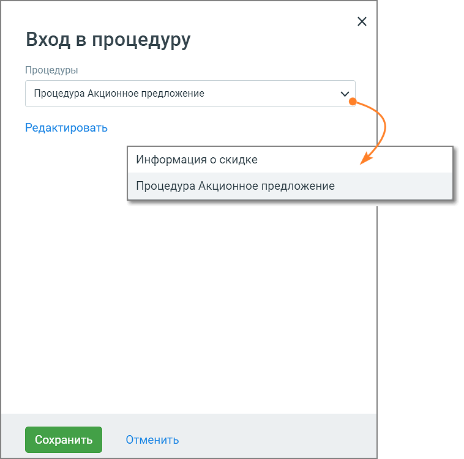

# 5.16. Блок Вход в процедуру

> Трассировка: PDF §5.16 · сквозные стр. 121-122 · источники: ч.1 `kb/sources/cov-robot-fil/Модуль ЦОВ Робот Фил 2,0_manual_v7.26.28.pdf` с.121-122.

Блок доступен при создании скрипта для Роботов, Роботов-администраторов и Чат-ботов. Вход в процедуру – это блок для встраивания процедуры (фрагмента скрипта) в основной скрипт.

Элементы настроек блока: 1. Название блока – название блока, должно быть уникальным в рамках скрипта. Максимальное количество символов – 50. 2. Процедуры – поле для выбора встраиваемой в скрипт процедуры. Клик по пиктограмме «стрелка вниз» открывает всплывающее окно со списком доступных процедур. Если процедуры для скрипта отсутствуют, система предложит их создать. 3. Кнопка «Редактировать» открывает выбранную процедуру для редактирования. Если эта процедура используется в других блоках скрипта, в них также будет использоваться отредактированный вариант. 4. Кнопка «Сохранить» – сохраняет внесенные изменения, форма настроек блока закрывается. 5. Кнопка «Отменить» – закрывает форму настройки блока, без сохранения изменений.
