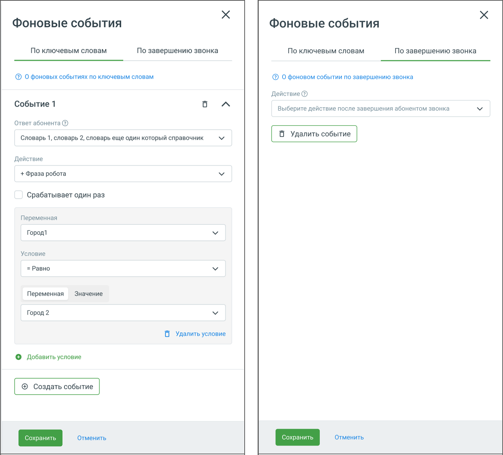

# 5.17. Блок Фоновые события

> Трассировка: PDF §5.17 · сквозные стр. 122-125 · источники: ч.1 `kb/sources/cov-robot-fil/Модуль ЦОВ Робот Фил 2,0_manual_v7.26.28.pdf` с.122-125.

Блок доступен только при создании скрипта для Голосовых роботов.

В блоке «Фоновые события» робот отслеживает определенные (ключевые) слова абонента или завершение разговора по инициативе абонента. При их возникновении робот выполняет заданные пользователем действия. Блок позволяет роботу запускать дополнительные ветки сценария при определенных условиях, отрабатывать сторонние процессы, отвечать на дополнительные вопросы абонента и затем бесшовно возвращаться к основному скрипту. Блок «Фоновые события» не привязан к определенному месту скрипта и отслеживает заданные параметры в течении всего звонка. В блоке доступно два варианта событий:  По ключевым словам – срабатывает, когда абонент произносит слова или фразы, заданные в сценарии.  По завершению звонка – активируется после окончания разговора.

Элементы настроек блока (общие): Название блока – название блока, должно быть уникальным в рамках скрипта. Максимальное количество символов – 50. Кнопка Сохранить – сохраняет внесенные изменения, форма настроек блока закрывается. Кнопка Отменить – закрывает форму настройки блока, без сохранения изменений. Настройка событий По ключевым словам:

1. Ответ абонента – выпадающий список для выбора варианта ответа абонента. Список настраивается в разделе Справочник ответов. При выборе значения «Любой ответ» робот распознает любую фразу, сказанную абонентом, и отобразит ее в статистике. При этом ответом считается только фраза, произнесенная абонентом. Выбранный пакет вариантов ответов Справочника должен быть уникальным в рамках блока. 2. Действие – следующий блок скрипта при выборе этого варианта ответа. Например, робот может произнести заранее настроенную фразу или выполнить другое действие, предусмотренное скриптом. 3. Срабатывает один раз – чекбокс, активирующий условие однократного срабатывания в рамках текущего разговора. 4. Переменные и условия – пользователь может указать переменную и задать условие её сравнения со значением. Например, условие «Переменная Город1 равно Город2» задаёт дополнительную проверку перед выполнением действия. Для добавления новых условий и переменных доступны кнопки Добавить условие и Добавить действие. Добавить связку можно не более 10 раз. Настройка событий По завершению звонка: Данный режим позволяет задать действия, которые будут выполнены после завершения разговора. В интерфейсе имеется выбор доступных действий в выпадающем списке. Для каждого события предусмотрены:  Кнопка Удалить событие для его удаления.  Кнопки Сохранить и Отменить для сохранения или отмены изменений. Данный блок позволяет улучшить гибкость и автоматизацию взаимодействия робота с клиентами, адаптируя сценарии на основе произнесённых фраз и итогов разговора.
