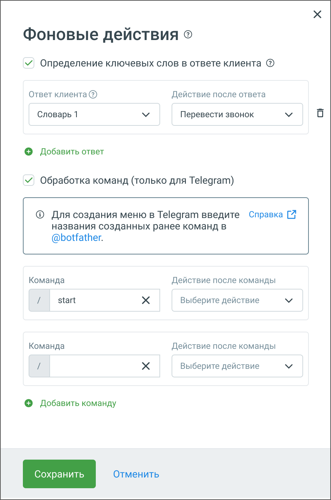
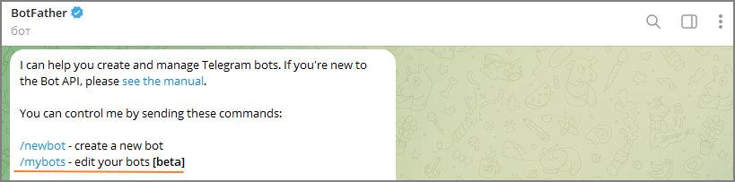

# 5.18. Блок Фоновые действия

> Трассировка: PDF §5.18 · сквозные стр. 125-128 · источники: ч.1 `kb/sources/cov-robot-fil/Модуль ЦОВ Робот Фил 2,0_manual_v7.26.28.pdf` с.125-128.

Блок доступен только при создании скрипта для чат-ботов. Блок "Фоновые действия" предназначен для настройки автоматических действий, выполняемых чат-ботом в ответ на определенные команды или ключевые слова. Этот блок включает две основные функции: определение ключевых слов в ответах клиента и обработка команд (только для Telegram).

В блоке доступно два варианта событий: 1. Определение ключевых слов в ответе клиента  Выберите подходящий словарь ключевых слов из выпадающего меню (например, "Словарь 1").

 Установите действие, которое будет выполнено после выявления ключевого слова в ответе клиента. Например, выберите "Перевести звонок" из списка действий.  Для добавления новой связки "ответ-действие" нажмите кнопку "Добавить ответ" и повторите процесс. 2. Обработка команд (только для Telegram)  В поле "Команда" введите команду, которую будет распознавать чат-бот (например, "/start" или "/stop").  В поле "Действие после команды" выберите действие, которое будет выполнено после ввода данной команды (выберите соответствующее действие из выпадающего меню).  Для добавления новой связки "команда-действие" нажмите кнопку "Добавить команду" и повторите процесс. После настройки всех необходимых параметров нажмите кнопку "Сохранить" для сохранения изменений. Для создания команд в @botfather выполните следующие шаги: Шаг 1: Запустите @botfather  Откройте приложение Telegram.  В строке поиска введите @botfather.  Выберите официального бота @botfather и нажмите "Start". Шаг 2: Выберите вашего бота  В списке команд @botfather найдите и выберите /mybots.  Выберите вашего бота из списка, если у вас несколько ботов. 

 Шаг 3: Настройте команды  Последовательно выберите команды Edit Bot и Edit Commands из списка команд.  Введите список команд в следующем формате (без символа "/"): o команда1 - описание команды

o команда2 - описание команды Например: o start – начало работы с ботом o stop – завершение работы с ботом Шаг 4: Подтвердите изменения  Нажмите "Send" или "Отправить".  @botfather подтвердит успешное обновление команд вашего бота.   Шаг 5: После создания команд в @botfather, вернитесь к настройкам вашего бота и свяжите команды с действиями через блок "Фоновые действия".
