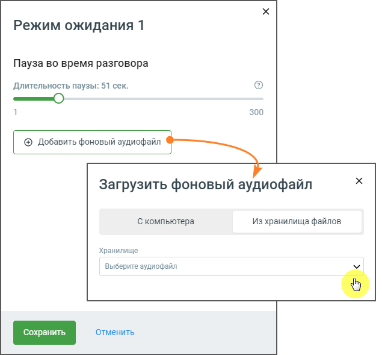
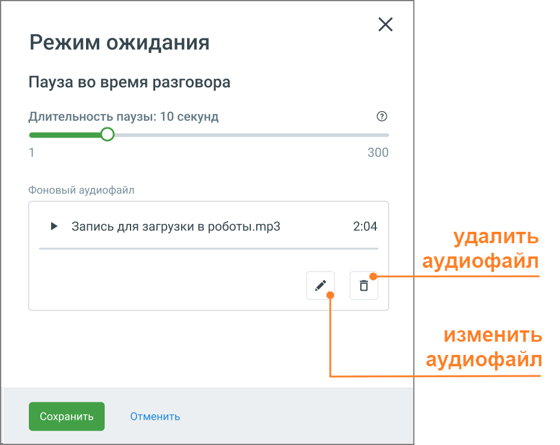

# 5.19. Блок Режим ожидания

> Трассировка: PDF §5.19 · сквозные стр. 128-130 · источники: ч.1 `kb/sources/cov-robot-fil/Модуль ЦОВ Робот Фил 2,0_manual_v7.26.28.pdf` с.128-130.

Блок доступен при создании скрипта для Голосовых роботов и Чат-ботов. Использование в скрипте Голосовых роботов блока "Режим ожидания" позволяет задать автоматическое воспроизведение музыкального фона во время пауз в диалоге. Это повышает удобство использования сервиса, убирая у абонента ощущение неопределенности. Размещение данного блока в теле скрипта Чат-бота дает возможность сделать паузу в диалоге для более плавного перехода к следующим этапам скрипта.

Элементы настроек блока: 1. Пауза во время разговора. Пауза в разговоре настраивается с помощью ползунка, который позволяет установить желаемую длительность от 1 до 300 секунд. 2. Фоновый аудиофайл. В поле необходимо загрузить аудиофайл, который будет использоваться в качестве музыкального сопровождения во время пауз. Для загрузки доступны два варианта: с компьютера пользователя или выбор из ранее загруженных в Хранилище файлов. Блок для скриптов Чат-ботов возможности загрузить голосовой файл не предоставляет. 3. Управление аудиофайлами. После загрузки аудиофайла отображаются дополнительные опции управления:

 Изменить аудиофайл: клик по иконке дает возможность загрузить новый файл.

 Удалить аудиофайл: клик по иконке удаляет файл из текущего списка воспроизведения.

4. Кнопка «Сохранить» – сохраняет внесенные изменения, форма настроек блока закрывается. 5. Кнопка «Отменить» – закрывает форму настройки блока, без сохранения изменений. Блок "Режим ожидания" идеально подходит для управления временем паузы в диалоге с абонентом, где необходимо организовать время его ожидания наиболее комфортно.
