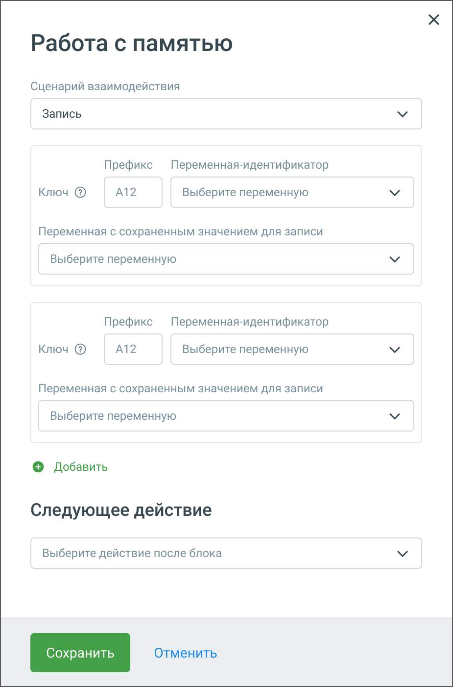

# 5.20. Блок Работа с памятью

> Трассировка: PDF §5.20 · сквозные стр. 130-132 · источники: ч.1 `kb/sources/cov-robot-fil/Модуль ЦОВ Робот Фил 2,0_manual_v7.26.28.pdf` с.130-132.

Блок доступен только при создании скрипта для роботов-администраторов. Блок "Работа с памятью" предназначен для хранения и использования данных внутри скриптов робота- администратора. Эта функция позволяет работать с Хранилищем памяти - записывать, читать и удалять данные, что исключает необходимость использования облачных сервисов, таких как Google Sheets. Данный подход улучшает скорость работы и упрощает анализ данных.

Элементы настроек блока: 1. Сценарий взаимодействия  Запись данных. Сценарий записи данных включает ключ (который может быть переменной или статичным значением) и данные для записи (также могут быть переменной или статичным значением).

Для записи данных в хранилище памяти укажите префикс ключа, например, А12, и выберите переменную- идентификатор, например, "Номер телефона". Также выберите переменную, содержащую значение, например, "Имя", для записи в хранилище памяти. ПРИМЕР 1: После подстановки данных из переменной-идентификатора ключ может иметь вид А12+79001234567, а значение будет "Иван". Ключ и значение будут записаны в хранилище памяти. Максимальная длина ключа или значения: 128 символов на латинице или 64 символа на кириллице. Переменная с сохраненным значением и переменная-идентификатор должны быть заполнены. Если они будут пустыми, запись в хранилище памяти не произойдет.  Поиск и чтение данных. Сценарий чтения данных включает ключ для поиска и значение, которое будет записано в переменную робота. Чтение также может быть множественным, что позволяет искать и извлекать несколько значений по разным ключам одновременно. Для поиска в хранилище памяти и записи найденного значения в указанную переменную укажите префикс ключа, например, А12, и выберите переменную-идентификатор, например, "Номер телефона", для нахождения ранее записанного значения. ПРИМЕР 2: После подстановки данных из переменной-идентификатора ключ может иметь вид А12+79001234567, а соответствующее значение будет "Иван". Значение "Иван" будет записано в указанную переменную в разделе "Сохранение найденного значения". Эту переменную можно использовать далее в скрипте.  Удаление данных. Для удаления данных из хранилища памяти укажите префикс ключа, например, А12, и выберите переменную-идентификатор, например, "Номер телефона", чтобы найти соответствующее значение для удаления. ПРИМЕР 3. После подстановки данных из переменной-идентификатора ключ может иметь вид А12+79001234567, а соответствующее значение будет "Иван". Ключ и значение будут удалены из хранилища памяти. 2. Следующее действие – следующий блок скрипта.

| Данные в Хранилище памяти не привязаны к конкретному скрипту и могут использоваться в любом другом скрипте |
| --- |
| сервиса. |
