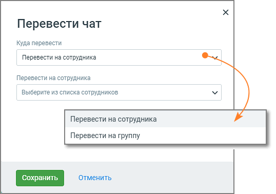

# 5.21. Блок Перевести чат

> Трассировка: PDF §5.21 · сквозные стр. 132-133 · источники: ч.1 `kb/sources/cov-robot-fil/Модуль ЦОВ Робот Фил 2,0_manual_v7.26.28.pdf` с.132-133.

Блок доступен только при создании скрипта для Чат-ботов. Робот выполняет перевод чата на оператора, чтобы клиенты могли общаться с опытным оператором в случае возникновения проблем.

Элементы настроек блока: 1. Название блока – название блока, должно быть уникальным в рамках скрипта. Максимальное количество символов – 50. 2. Куда перевести:  На сотрудника – чат будет переведен на сотрудника, выбранного в выпадающем списке «Сотрудники». Список сформирован из сотрудников, подключенных к ВАТС и находящихся в статусе «На линии».  На группу – чат будет переведен на группу, выбранную в выпадающем списке «Группы»; 3. Кнопка «Сохранить» – сохраняет внесенные изменения, форма настроек блока закрывается. 4. Кнопка «Отменить» – закрывает форму настройки блока, без сохранения изменений. При переводе чата сотруднику данные чата передаются в Контакт-центр. Таким образом сотрудник будет иметь всю необходимую информацию для диалога с клиентом.
