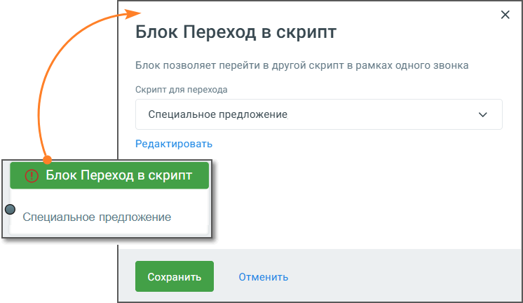

# 5.23. Блок Переход в скрипт

> Трассировка: PDF §5.23 · сквозные стр. 134-135 · источники: ч.1 `kb/sources/cov-robot-fil/Модуль ЦОВ Робот Фил 2,0_manual_v7.26.28.pdf` с.134-135.

Блок доступен при создании скрипта для Голосовых роботов. Блок Переход к другому скрипту используется для организации переходов между различными скриптами в рамках одной сессии работы голосового робота. При его срабатывании выполнение текущего сценария завершается, и автоматически запускается заранее заданный скрипт. Такой механизм позволяет строить более сложные и масштабируемые схемы взаимодействия с абонентами, разбивая общую логику на отдельные, независимые модули.

Элементы настройки блока: 1. Название блока – должно быть уникальным в рамках скрипта. Максимальное количество символов – 50. 2. Скрипт для перехода: выпадающий список со всеми доступными скриптами, в которые разрешено выполнить переход. Пользователь выбирает целевой скрипт, отличный от текущего. 3. Редактировать: ссылка открывает выбранный скрипт в новой вкладке конструктора для просмотра или внесения изменений. 4. Кнопки управления:  Сохранить – применяет настройки блока и закрывает окно.  Отменить – закрывает окно без сохранения изменений.

| ПРИМЕР Разделение бизнес-логики на два скрипта Скрипт-исходник: «Подтверждение контактных данных» Скрипт-назначение: «Оформление заявки» Сценарий: Клиенту звонит голосовой робот, использующий скрипт «Подтверждение контактных данных». В ходе диалога робот уточняет у клиента ФИО, номер телефона и электронную почту. Если все данные подтверждены, в последнем блоке скрипта размещён блок «Переход к другому скрипту», через который вызывается скрипт «Оформление заявки». В «Оформлении заявки» клиенту предлагается выбрать продукт, услугу и подтвердить согласие на дальнейшую обработку. При этом все ранее собранные данные передаются автоматически. Преимущества:  Повторное использование «Оформления заявки» в других сценариях (например, после «Проверки задолженности»).  Простота редактирования: при изменении логики оформления правки вносятся только в один скрипт.  Масштабируемость: разделение логики снижает риск достижения лимитов на количество блоков. |
| --- |
| Важно: Невозможно удалить скрипт, если он используется как дочерний при переходе из других скриптов. |
