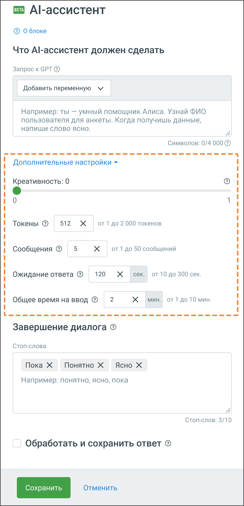

# 5.24. Блок AI-ассистент для чат-ботов

> Трассировка: PDF §5.24 · сквозные стр. 135-140 · источники: ч.1 `kb/sources/cov-robot-fil/Модуль ЦОВ Робот Фил 2,0_manual_v7.26.28.pdf` с.135-140.

Блок доступен только при создании скрипта для чат-ботов.

Важно: Для подключения услуги обратитесь к персональному менеджеру. Блок «AI-ассистент» предназначен для автоматизированного общения чат-бота с клиентом с использованием GPT. Он позволяет боту анализировать запросы пользователей, формулировать осмысленные ответы и адаптироваться под сценарии диалога. Блок дает возможность:  Задавать AI-ассистенту конкретные задачи и стиль общения через текстовый запрос к GPT.  Настраивать параметры работы модели, такие как креативность, лимит токенов и время ожидания ответа.  Определять условия завершения диалога с помощью стоп-слов.  Сохранять полученные ответы в переменные для дальнейшего использования в сценарии.

Основные настройки блока: 1. Запрос к GPT: Поле запроса формирует поведение AI-ассистента. В нем можно задать:  Роль: Например, «Ты – умный помощник, который помогает клиентам заполнять анкету».  Задачу: «Спроси у пользователя его ФИО и дату рождения. Формат может быть свободным».  Финальную фразу: «Когда получишь все данные, напиши слово ‘ясно’». Можно использовать переменные, чтобы AI-ассистент обрабатывал данные с учетом текущего контекста диалога. ПРИМЕР ЗАПРОСА: Ты – голосовой ассистент компании. Твоя задача – узнать номер заказа у клиента и передать его оператору. Сначала спроси: «Назовите, пожалуйста, номер вашего заказа». Если клиент отвечает, повтори номер и спроси: «Верно?». Если клиент подтвердил, напиши «Спасибо, передаю данные оператору». Если номер неверный, предложи ввести его заново. 2. Стоп-слова: Стоп-слова позволяют завершать диалог с AI-ассистентом, чтобы бот мог продолжить выполнение основного сценария.  Пользователь может задать до 10 стоп-слов.  Если клиент использует одно из стоп-слов (например, «понятно», «ок», «ясно»), AI- ассистент завершает диалог.  Стоп-слова должны совпадать с теми, что указаны в запросе к GPT, иначе AI-ассистент может не понять, когда завершить диалог. 3. Обработать и сохранить ответ: Если этот параметр включен, AI-ассистент не просто завершает диалог, но и сохраняет ответ пользователя в переменную для дальнейшего использования в сценарии.  Например, можно сохранить имя клиента, номер заказа или другие данные, которые могут потребоваться на следующих шагах диалога.  Если параметр включен, выход из блока будет всегда по ветке «Обработка ответа». Дополнительные настройки блока: 4. Креативность: Определяет степень случайности в ответах AI-ассистента:  0 – ответы максимально точные и предсказуемые, основанные на запросе.  1 – AI-ассистент генерирует более разнообразные, иногда нестандартные ответы.

5. Токены: Токен – это единица обработки текста. 1 токен ≈ 3 символа.  Минимальное значение – 1, максимальное – 2000.  Чем больше токенов выделено, тем длиннее может быть ответ AI-ассистента.  Если бот использует слишком много токенов, это может привести к большему расходу ресурсов. 6. Сообщения: Определяет максимальное количество сообщений от AI-ассистента в одном диалоге.  Минимум – 1, максимум – 50.  Если пользователь не получил нужный ответ за установленное количество сообщений, скрипт перейдет в ветку ошибки. 7. Ожидание ответа: Время (в секундах), в течение которого AI-ассистент ждет ответ от пользователя перед тем, как считать, что клиент не отвечает.  Минимум – 10 секунд, максимум – 300 секунд.  Если время истекло, чат-бот переходит в ветку ошибки или завершения. 8. Общее время на ввод: Лимит времени (в минутах) на весь диалог между пользователем и AI- ассистентом.  Минимум – 1 минута, максимум – 10 минут.  Если диалог длится дольше установленного лимита, он автоматически завершается. Использование блока в сценариях Блок AI-ассистент делает чат-бот более адаптивным и интеллектуальным:  Может вести осмысленные диалоги и адаптироваться к ответам клиента.  Помогает автоматизировать сбор информации (например, контактные данные или номера заказов).  Позволяет запускать сложные сценарии с анализом пользовательских запросов.  Дает возможность сохранять важные данные и передавать их операторам или в CRM. Блок с настройками выгружается и загружается при импорте и экспорте скриптов. В статистике скрипта блок AI-ассистент отображает настройки, исходный промпт, диалог с клиентом и финальную ветку. Данные сворачиваются для удобства и выгружаются в CSV. Этот блок делает чат-бота гибким инструментом, способным не только вести стандартные диалоги, но и решать более сложные задачи, ориентируясь на потребности пользователей. Хранилище документов (RAG) позволяет подключить к ассистенту ваши собственные материалы – регламенты, инструкции, базы знаний, внутренние методички и другие рабочие документы.

