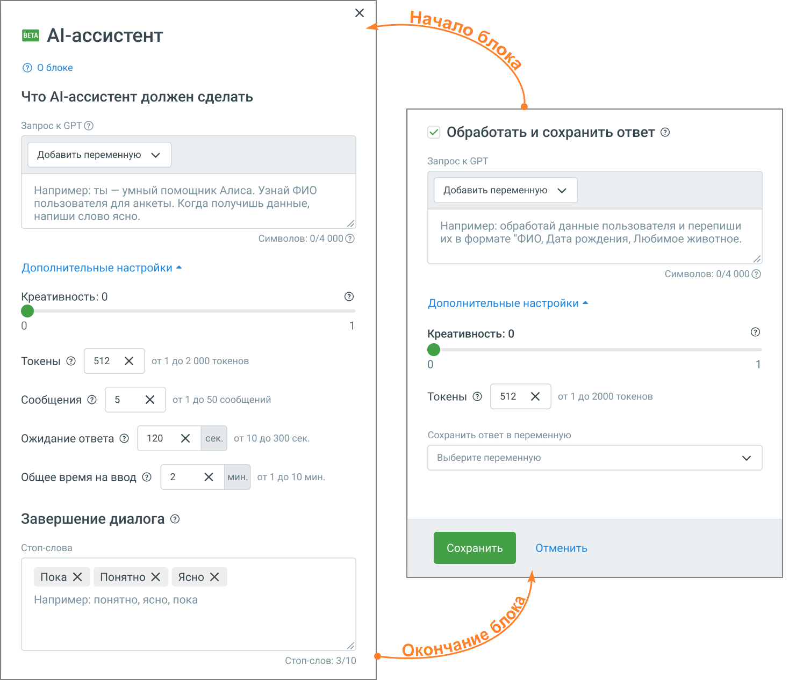

# 5.25. Блок AI-ассистент для голосовых роботов

> Трассировка: PDF §5.25 · сквозные стр. 140-142 · источники: ч.1 `kb/sources/cov-robot-fil/Модуль ЦОВ Робот Фил 2,0_manual_v7.26.28.pdf` с.140-142.

AI-ассистент – блок, предназначенный для обработки пользовательских сообщений с использованием языковой модели в голосовых роботах. Блок выполняет:  генерацию ответа на основе заданного запроса;  ведение диалога в рамках установленного контекста;  (опционально) обработку и сохранение результата в переменные сценария.

Элементы настроек блока: 1. Запрос к GPT – текст инструкции, который определяет поведение AI-ассистента и формирует его ответ.  используется для постановки задачи ассистенту  можно задать роль (например, консультант, оператор, помощник)  можно указать формат ответа (например, краткий, список, строгое значение)  поддерживается использование переменных сценария  от качества формулировки напрямую зависит результат работы модели 2. Креативность – параметр, определяющий степень вариативности ответа модели.  диапазон значений – от 0 до 1  0 – ответы максимально предсказуемые и стабильные  значения ближе к 1 – ответы более разнообразные и вариативные  влияет на стиль формулировок, но не на фактическое содержание задачи 3. Токены – ограничение на максимальный объём обрабатываемого и генерируемого текста.  диапазон значений – от 1 до 2000 токенов  1 токен ≈ 3 символа (в среднем). Чем больше символов в тексте – тем больше токенов нужно для его обработки.  учитываются как входные данные (контекст), так и ответ модели  при увеличении контекста (параметр «Сообщения») доступный объём ответа уменьшается  при превышении лимита ответ может быть обрезан 4. Сообщения – максимальное количество сообщений AI-ассистента. Влияет на:  сколько раз ассистент сможет ответить пользователю в рамках блока  насколько длинным будет диалог  возможность уточнять и развивать разговор  общий расход токенов (чем больше сообщений, тем больше используется ресурсов)  завершение диалога – после достижения лимита сообщений блок прекращает работу 5. Ожидание ответа – максимальное время ожидания ответа от модели (сек.). При превышении времени выполняется переход по ветке «Ошибка». Если пользователь выходит из ветки «Ошибка», скрипт продолжается 6. Общее время на ввод – ограничение на общую длительность диалога (мин.). По истечении времени ввод пользователя считается завершённым. Применяется для ограничения длительных сессий. 8. Как завершить диалог с AI-ассистентом (стоп-слова) – список слов или фраз для завершения диалога.

 при добавлении стоп-слов у блока появляется отдельная ветка выхода «Стоп-слово»  если пользователь произносит одно из этих слов, диалог завершается

| Важно: Стоп-слова срабатывают всегда, но если включена настройка «Обработать и сохранить ответ», выход из |
| --- |
| диалога всегда будет происходить через ветку «Обработка ответа». |

Обработка и сохранение ответа 9. Обработать и сохранить ответ – позволяет дополнительно обработать ответ пользователя и сохранить результат.  ответ отправляется в GPT ещё раз с заданной инструкцией  можно привести его к нужному виду (например, выделить ФИО или дату)  результат сохраняется в переменную  после включения этой настройки диалог всегда завершается через ветку «Обработка ответа» 13. Сохранить ответ в переменную – выбор переменной для записи результата обработки.  результат становится доступен в последующих блоках  используется для передачи данных в логику сценария Особенности работы AI-ассистента  при включённой настройке «Обработать и сохранить ответ» выполняются два вызова AI: основной и дополнительный для обработки результата;  параметр «Токены» ограничивает максимальный размер ответа и влияет на доступный объём контекста;  при большом количестве сообщений часть раннего диалога может не учитываться из-за ограничения по токенам;  результат работы зависит от формулировки запроса к AI – некорректный запрос может приводить к нестабильным или неверным ответам;  для задач с жёсткой структурой рекомендуется использовать обработку ответа с низкой креативностью.
