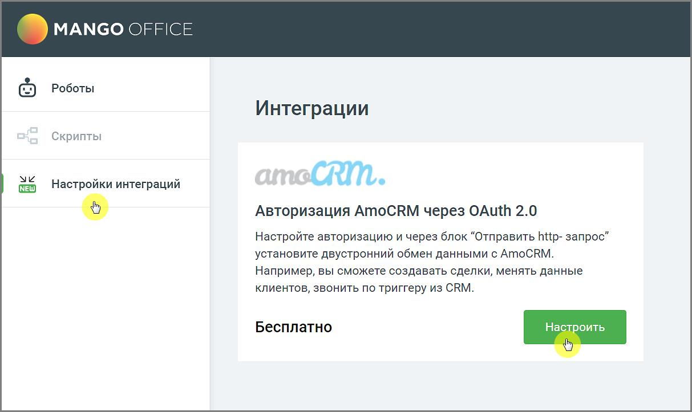
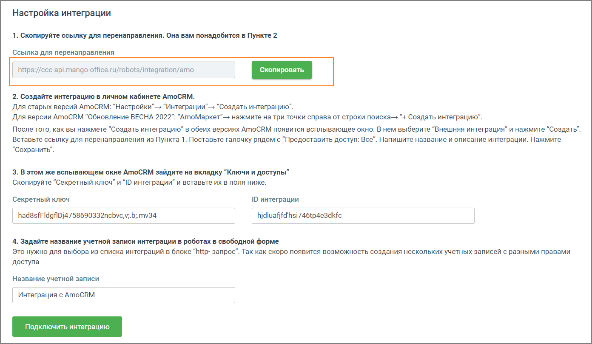
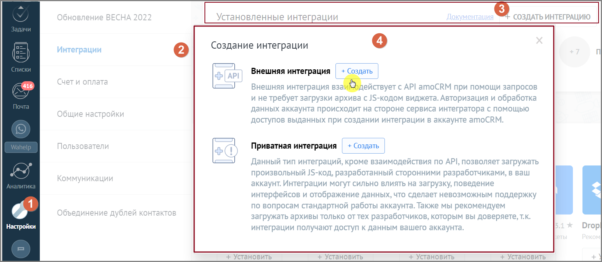
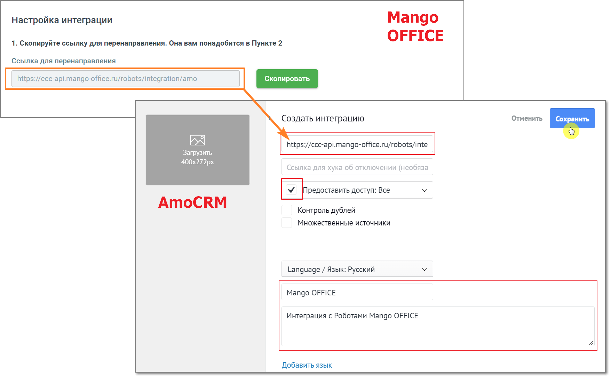
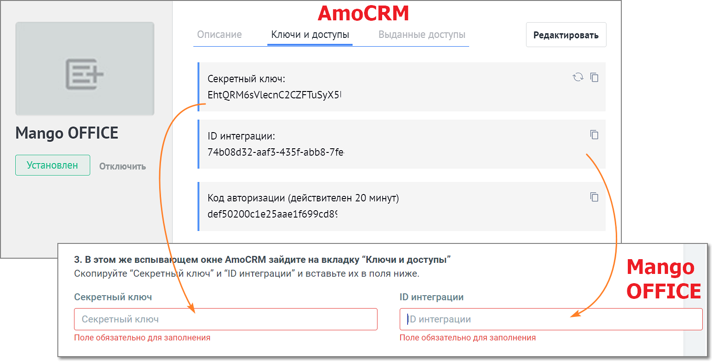
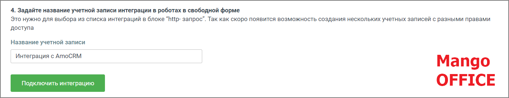

# 6.1. Интеграция с AmoCRM

> Трассировка: PDF §6.1 · сквозные стр. 142-146 · источники: ч.1 `kb/sources/cov-robot-fil/Модуль ЦОВ Робот Фил 2,0_manual_v7.26.28.pdf` с.142-146.

Модуль ЦОВ «Робот Фил 2,0» позволяет настраивать интеграцию с AmoCRM. После настройки двусторонней интеграции доступно создание сделок, изменение данных клиентов в AmoCRM или звонки по триггеру из AmoCRM.

Чтобы настроить интеграцию, перейдите в раздел вертикального меню «Настройки интеграций» и кликните на кнопку Настроить.

1) Ознакомьтесь с инструкцией по созданию интеграции. Скопируйте ссылку для перенаправления.

2) Войдите в свой аккаунт AmoCRM. Создайте интеграцию на стороне CRM одним из следующих вариантов:  Для старых версий AmoCRM: “Настройки”→ “Интеграции”→ “Создать интеграцию”.  Для версии AmoCRM “Обновление ВЕСНА 2022”: “AmoМаркет”→ нажмите на три точки справа от строки поиска→ “+ Создать интеграцию”. На рисунке ниже приведен пошаговый пример создания интеграции для старой версии AmoCRM.

Кликните по кнопке Создать.

В открывшемся окне заполните поля:  Создать интеграцию – в это поле необходимо скопировать ссылку для перенаправления  Предоставить доступ – проставить галочку в чекбоксе  Название интеграции  Описание интеграции Нажмите кнопку Сохранить. 3) В открывшемся окне перейдите во вкладку Ключи и доступы. Данными вкладки заполните поля настроек Mango OFFICE

4) Задайте название учетной записи и нажмите кнопку Подключить интеграцию.

В открывшемся окне подтвердите разрешение на доступ к данным. Вы создали интеграцию MANGO OFFICE и AmoCRM. Передача данных при помощи интеграции доступна в блоке Отправить http-запрос.
