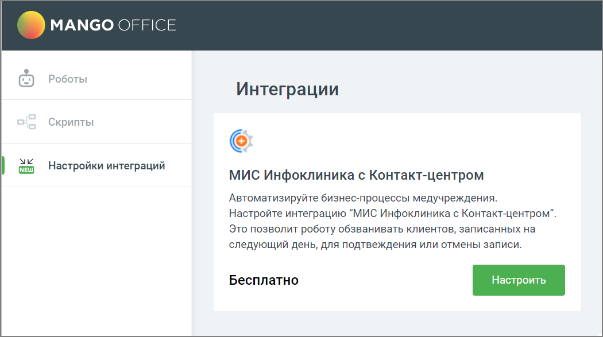

# 6.2. Интеграция с МИС Инфоклиника

> Трассировка: PDF §6.2 · сквозные стр. 146-148 · источники: ч.1 `kb/sources/cov-robot-fil/Модуль ЦОВ Робот Фил 2,0_manual_v7.26.28.pdf` с.146-148.

После настройки интеграции с МИС Инфоклиника медицинские компании, использующие в работе ПО "Инфоклиника", могут настроить взаимодействие робота с их системой. Робот самостоятельно может осуществлять следующие действия:  Обзвон записанных на прием клиентов с помощью роботов или операторов Контакт-Центра по заданным пользователем параметрам;  Автоматическое подтверждение записей на прием по результатам обзвона роботом Контакт- Центра;

 Автоматическая отмена записей на прием по результатам обзвона роботом Контакт-Центра. Таким образом к обзвону не подключаются операторы и весь сценарий выполняется посредством автоматизации.

Интеграция с МИС «Инфоклиника» подключается через Личный кабинет пользователя ВАТС. Клик по кнопке Настроить открывает информационную страницу со ссылкой на раздел Интеграции ЛК ВАТС. Инструкция по подключению доступна в Руководстве пользователя ВАТС - Справочник ВАТС. По подключении необходимо создать пользовательские поля в Контакт-центре, в разделе “Исходящий обзвон”:  Идентификатор записи;  Идентификатор пациента;  Дата назначения на прием;  Время начала приема;  Время окончания приема;  Идентификатор филиала;  ФИО врача;  Название отделения;  Название кабинета;  Дата рождения.

Подробнее о создании пользовательских полей см. в Справке Контакат-центра MANGO OFFICE.
