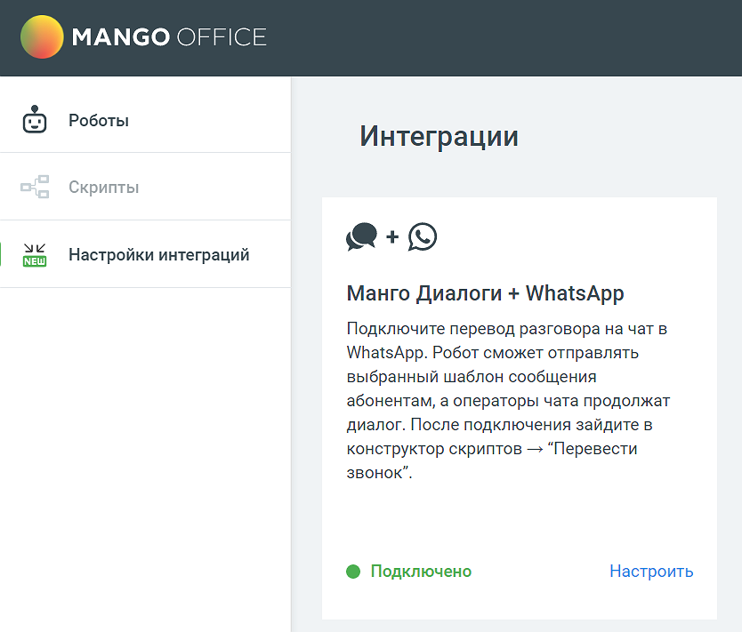

# 6.3. Интеграция с MANGO Диалоги

> Трассировка: PDF §6.3 · сквозные стр. 148-149 · источники: ч.1 `kb/sources/cov-robot-fil/Модуль ЦОВ Робот Фил 2,0_manual_v7.26.28.pdf` с.148-149.

Для настройки интеграции с MANGO Диалоги следует зайти в раздел Настройки интеграций левого бокового меню модуля, выбрать «Манго Диалоги + WhatsApp» и нажать кнопку Подключить. После настройки интеграции пользователь сможет:  подключить отправку сообщений в WhatsApp при соответствующей команде голосового меню;  настроить шаблон сообщения, которое получит клиент;  вести переписку с клиентами, которые ответили на сообщения HSM.

Интеграция подключится автоматически, если:  В Личном кабинете пользователя ВАТС подключен модуль «MANGO Диалоги» и настроен канал связиWhatsApp.  Имеется хотя бы один шаблон WhatsApp, созданный в WhatsApp Business (провайдер Edna)

