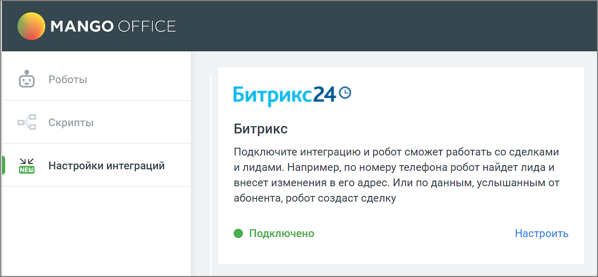

# 6.4. Интеграция с Битрикс24

> Трассировка: PDF §6.4 · сквозные стр. 149 · источники: ч.1 `kb/sources/cov-robot-fil/Модуль ЦОВ Робот Фил 2,0_manual_v7.26.28.pdf` с.149.

Администратор, отвечающий за настройку роботов, может подключить и настроить взаимодействие робота с Битрикс24. Робот будет создавать новый лид/сделку в Битрикс24. Ресурсы операторов не будут тратиться на звонки, на наполнение клиентской базы для последующего «подогрева» к продаже. Для настройки интеграции с Битрикс24. следует зайти в раздел Настройки интеграций левого бокового меню модуля, выбрать «Битрикс24» и нажать кнопку Подключить. После подключения в скрипте доступны настройки сценариев работы робота с этой CRM системой. Примечание. Доступно подключения только 1 учетной записи Битрикс24.

Клик по кнопке Настроить открывает информационное окно с краткой инструкцией по настройке интеграции. Чтобы настроить интеграцию в Личном кабинете Битрикс последовательно перейдите в разделы меню
