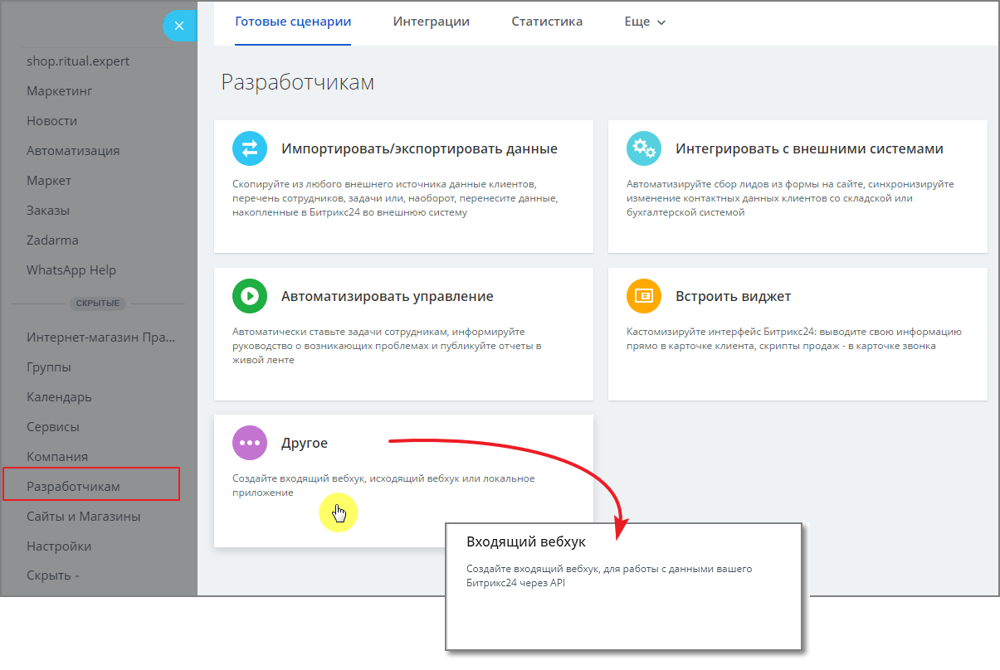
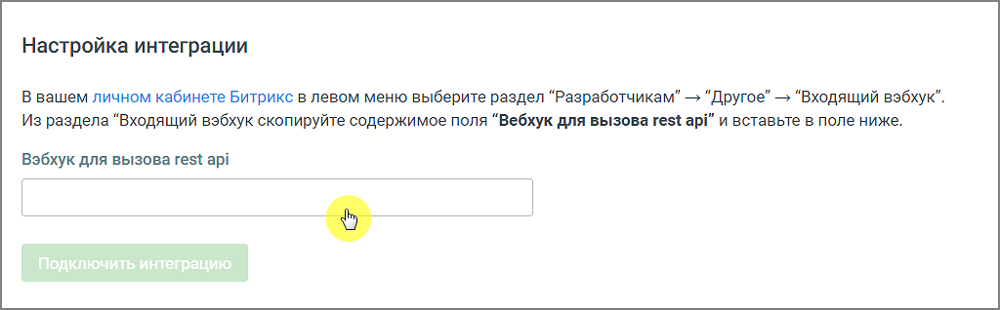

# Разработчикам → Другое → Входящий вебхук: https://ваше_имя _CRM/devops/section/standard/

> Трассировка: PDF §6.4 · сквозные стр. 149-151 · источники: ч.1 `kb/sources/cov-robot-fil/Модуль ЦОВ Робот Фил 2,0_manual_v7.26.28.pdf` с.149-151.

Скопируйте данные из поля «Вебхук для вызова rest api», далее вернитесь в модуль Роботы MANGO OFFICE и разместите скопированные данные в поле Настройки интеграции.

Нажмите кнопку Подключить интеграцию. Теперь вы можете работать со сделками и лидами Битрикс при помощи блока Интеграции конструктора скриптов.

| Совет. Если после нажатия кнопки Подключить интеграцию система выдает сообщение об ошибке, проверьте – |
| --- |
| нет ли в ссылке вебхука лишних пробелов до или после ссылки. |
