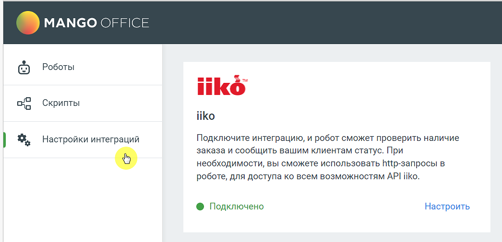
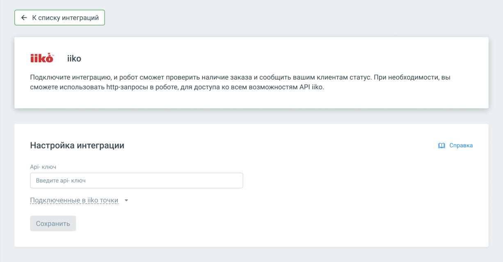
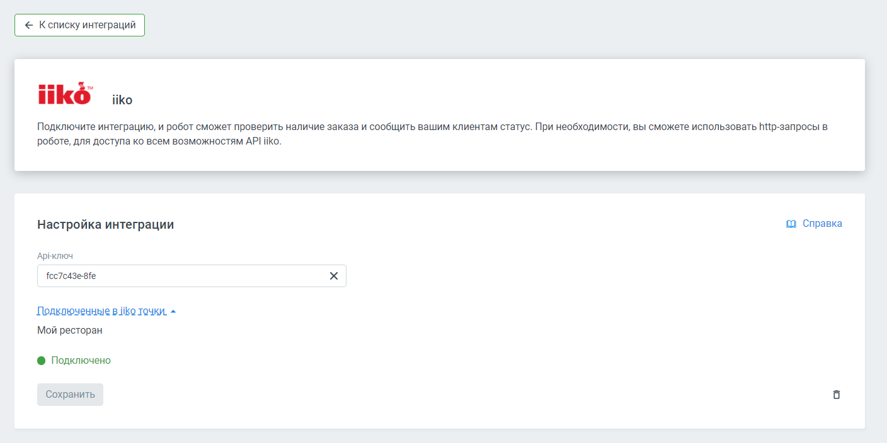

# 6.5. Интеграция с IIKO

> Трассировка: PDF §6.5 · сквозные стр. 151-153 · источники: ч.1 `kb/sources/cov-robot-fil/Модуль ЦОВ Робот Фил 2,0_manual_v7.26.28.pdf` с.151-153.

Администратор, отвечающий за настройку роботов, может подключить и настроить взаимодействие робота с IIKO. Робот будет проверять проверить наличие заказа и сообщать вашим клиентам информацию о заказе в момент звонка. Для настройки интеграции следует зайти в раздел Настройки интеграций левого бокового меню модуля, выбрать «IIKO» и нажать кнопку Подключить.

После подключения интеграцию необходимо настроить.

Заполните поле Api-ключ своими данными и нажмите кнопку «Сохранить».

| Совет: Чтобы получить API-ключ iiko, необходимо обратиться в свою организацию-поставщика услуг iiko, либо |
| --- |
| оставить заявку в форме на сайте api.iiko.ru. |

После успешного подключения ваши подключенные к iiko точки отобразятся в настройках интеграции. В блоке «Интеграции» конструктора скриптов будет доступен способ интеграции «Интеграция с iiko».

