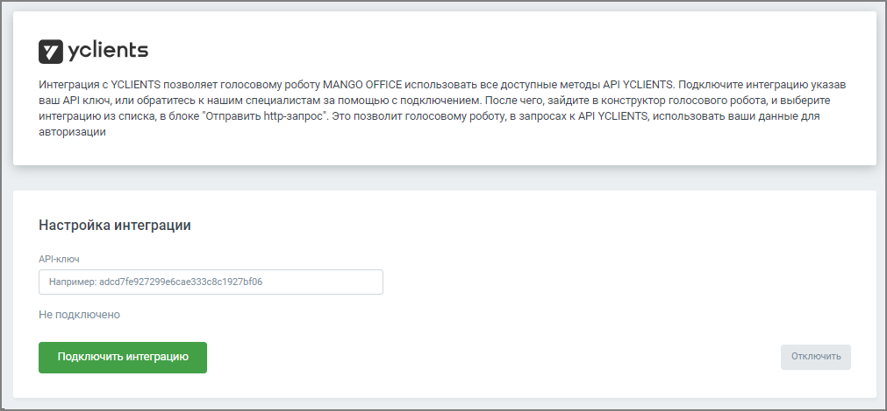
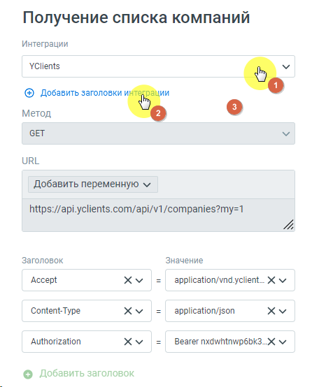

# 6.6. Интеграция с YCLIENTS

> Трассировка: PDF §6.6 · сквозные стр. 153-155 · источники: ч.1 `kb/sources/cov-robot-fil/Модуль ЦОВ Робот Фил 2,0_manual_v7.26.28.pdf` с.153-155.

Администратор, отвечающий за настройку роботов, может подключить и настроить взаимодействие робота с YCLIENTS. После подключения в момент звонка робот может выполнять в системе YCLIENTS следующие функции:  Записать клиента в расписание в удобное для него время;  Принять звонок и произвести корректировку записи клиента;  Перевести звонок в чат-бот WhatsApp или Telegram. Для настройки интеграции следует зайти в раздел Настройки интеграций левого бокового меню модуля, выбрать «YCLIENTS» и нажать кнопку Подключить.

После подключения интеграцию необходимо настроить.

После успешного подключения в блоке «HTTP-запрос» конструктора скриптов для роботов, а также в блоке «Интеграция» конструктора скриптов для робота-администратора будет доступен способ интеграции «YCLIENTS». ПРИМЕР. Администратор, отвечающий за настройку голосового робота, может использовать ключи авторизации в http-запросе, чтобы не терять время на повторный ввод этих данных в каждом http-запросе:

