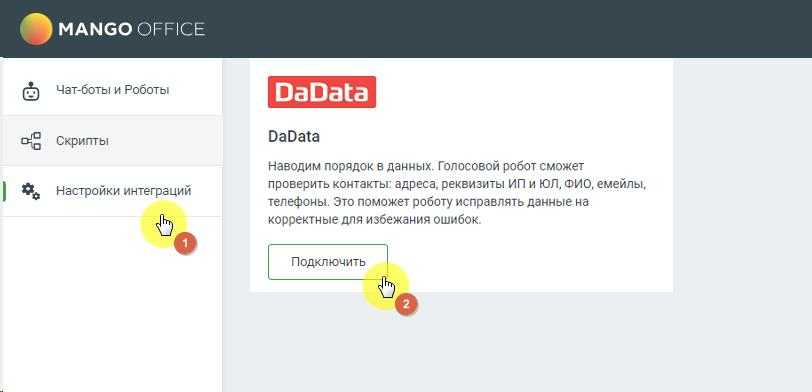
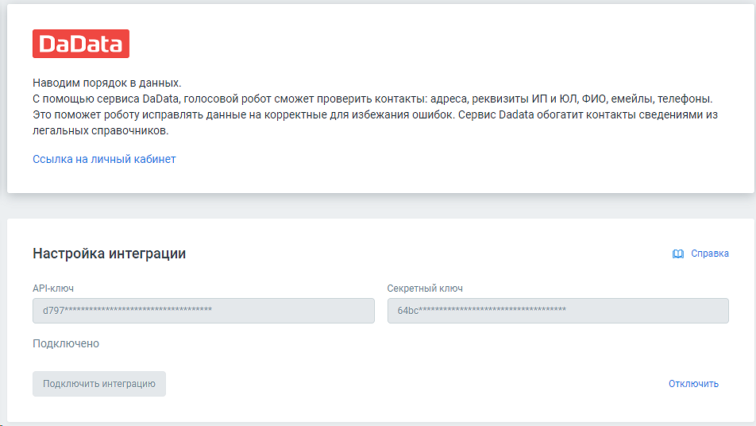
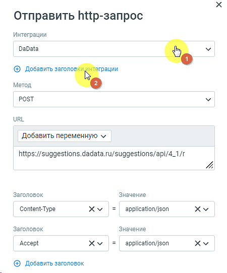

# 6.7. Интеграция с DaData

> Трассировка: PDF §6.7 · сквозные стр. 155-157 · источники: ч.1 `kb/sources/cov-robot-fil/Модуль ЦОВ Робот Фил 2,0_manual_v7.26.28.pdf` с.155-157.

Администратор, отвечающий за настройку роботов, может подключить и настроить взаимодействие робота с DaData. После подключения в момент звонка робот может выполнять в системе DaData следующие функции:  Адреса – автоматически проверяет, исправляет и геокодирует адреса;  Телефоны и email – проверяет телефон по Россвязи, определяет оператора, отсеивает одноразовые email;  ФИО и паспорта – проверяет и разбирает ФИО из строки. Проверяет паспорт по справочнику МВД;  Стандартизация – массово проверяет и исправляет контактные данные из файла и др. Для настройки интеграции следует зайти в раздел Настройки интеграций левого бокового меню модуля, выбрать «DaData» и нажать кнопку Подключить.

В открывшемся окне заполните поля «API-ключ», «Cекретный ключ» и нажмите кнопку Подключить. Совет: API-ключ и секретный ключ автоматически генерируются в Личном кабинете пользователя DaData. После настройки и подключения интеграция получит статус «Подключено».

После успешного подключения в блоке «HTTP-запрос» конструктора скриптов будет доступен способ интеграции «DaData».

ПРИМЕР. Администратор, отвечающий за настройку голосового робота, может использовать ключи авторизации в http-запросе, чтобы не терять время на повторный ввод этих данных в каждом http-запросе:

