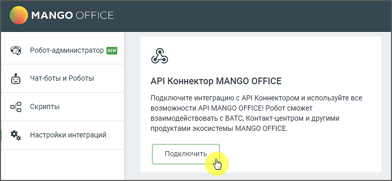

# 6.8. Интеграция с API Коннектор MANGO OFFICE

> Трассировка: PDF §6.8 · сквозные стр. 157-158 · источники: ч.1 `kb/sources/cov-robot-fil/Модуль ЦОВ Робот Фил 2,0_manual_v7.26.28.pdf` с.157-158.

Модуль ЦОВ «Робот Фил 2,0» позволяет настраивать интеграцию с API Коннектором MANGO OFFICE. Эта функциональность обеспечивает взаимодействие робота-администратора с методами API ВАТС и Контакт-центра. Подключение данного модуля дает возможность использовать все преимущества API MANGO OFFICE для оптимизации бизнес-процессов и улучшения качества обслуживания клиентов. Для активации интеграции необходимо перейти в раздел «Настройки интеграций» и выбрать виджет «API Коннектор MANGO OFFICE». После подключения вы получите доступ к управлению этой функцией, что позволит настроить работу робота согласно требованиям вашего бизнеса.

Важно: Для активации интеграции в Личном кабинете пользователя ВАТС должен быть настроен API Коннектор.
