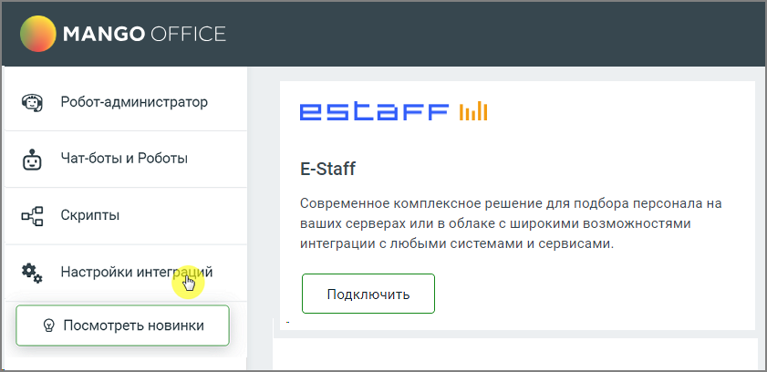
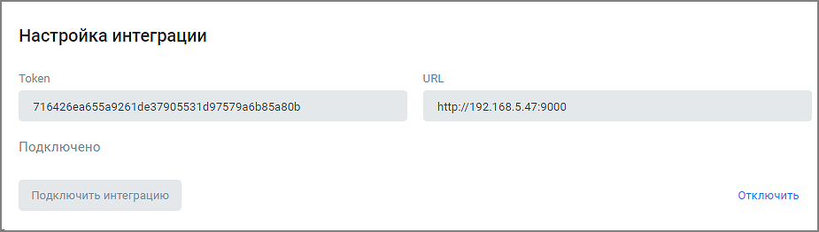

# 6.9. Интеграция с E-Staff

> Трассировка: PDF §6.9 · сквозные стр. 158-160 · источники: ч.1 `kb/sources/cov-robot-fil/Модуль ЦОВ Робот Фил 2,0_manual_v7.26.28.pdf` с.158-160.

E-staff – система автоматизации подбора персонала. Интеграция с E-staff позволит расширить возможности использования голосового робота:  Робот по заданному расписанию забирает из E-staff список кандидатов для обзвона  Робот наполняет кандидатов необходимыми данными из E-staff  Робот самостоятельно передает кандидатов в кампанию исходящего обзвона, для последующего обзвона голосовым роботом

Для настройки интеграции следует зайти в раздел Настройки интеграций левого бокового меню модуля, выбрать «E-Staff» и нажать кнопку Подключить. В открывшемся окне заполните поля «Token», «URL» и нажмите кнопку Подключить.

| Совет: Чтобы получить Token и URL, необходимо обратиться в E-Staff или свою организацию-поставщика услуг E- |
| --- |
| Staff. |

После настройки и подключения интеграция получит статус «Подключено».

