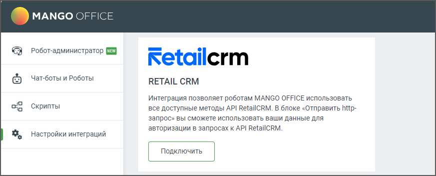
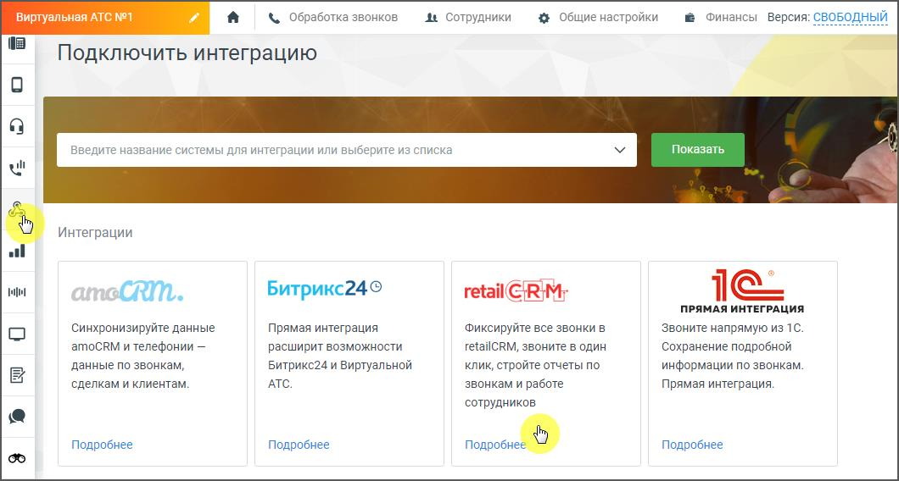

# 6.10. Интеграция с RetailCRM

> Трассировка: PDF §6.10 · сквозные стр. 160-161 · источники: ч.1 `kb/sources/cov-robot-fil/Модуль ЦОВ Робот Фил 2,0_manual_v7.26.28.pdf` с.160-161.

Администратор, настраивающий роботов, имеет возможность использовать API RetailCRM для управления своими заказами и клиентами в данной системе в рамках работы робота. Подключенная интеграция помогает клиентам автоматизировать использование RetailCRM в рамках голосовых звонков с помощью API. Это позволяет пользователям RetailCRM подключать роботов для входящей/исходящей линии и обрабатывать заказы автоматически.

Для подключения интеграции нажмите кнопку «Подключить». Затем в Личном кабинете ВАТС пройдите в раздел «Интеграции», выберите retailCRM и нажмите кнопку «Подробнее».

В открывшемся окне скачайте и ознакомьтесь с Руководством пользователя по настройке интеграции ВАТС и RetailCRM и произведите подключение. После успешного подключения в блоке HTTP-запрос конструктора скриптов для роботов, а также в блоке Интеграция конструктора скриптов для робота-администратора будет доступен способ интеграции «retailCRM». В случае отсутствия интеграции можно писать HTTP-запросы к RetailCRM вручную через блок HTTP-запроса.
