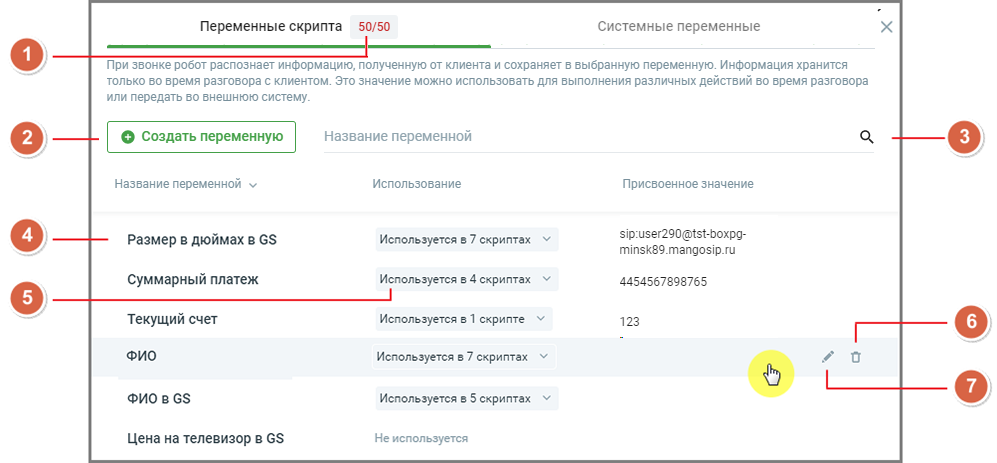
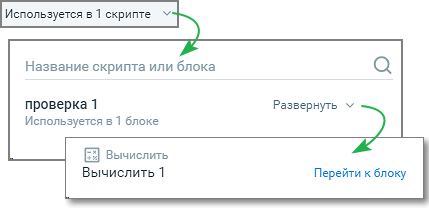
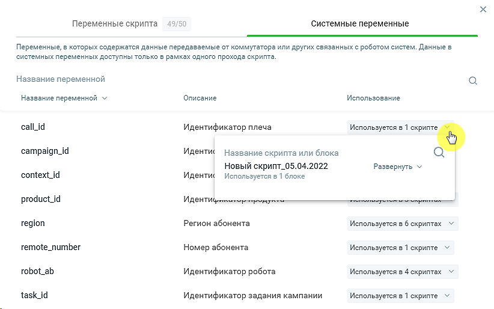
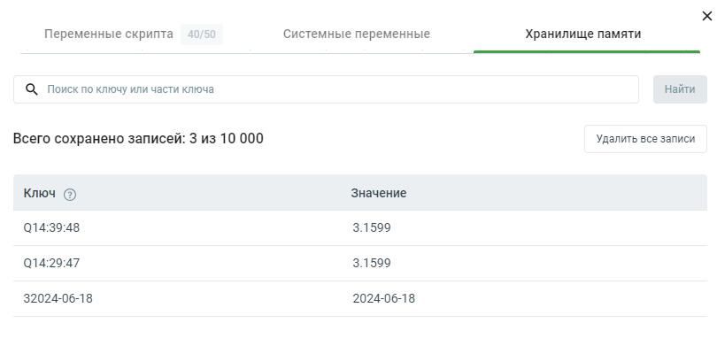

# 7. Переменные

> Трассировка: PDF §7 · сквозные стр. 161-166 · источники: ч.1 `kb/sources/cov-robot-fil/Модуль ЦОВ Робот Фил 2,0_manual_v7.26.28.pdf` с.161-166.

Модуль ЦОВ «Робот Фил 2,0» позволяет создавать переменные для чтения или записи данных, а также использовать переменные из Хранилища памяти и других модулей, подключенных в Личном кабинете пользователя ВАТС. В качестве переменных выступают:  Стандартные и пользовательские поля Адресной книги Контакт-центра MANGO OFFICE (чтение и запись данных).  Стандартные (чтение данных) и пользовательские (чтение и запись данных) поля Исходящего обзвона Контакт-центра MANGO OFFICE.  Пользовательские переменные, созданные в Справочнике переменных или блоках скрипта, данные в которых доступны только в рамках одного прохода скрипта (чтение и запись данных).  Поля карточки сотрудника Контакт-центра MANGO OFFICE (чтение данных).

 Системные переменные.  Стандартные поля текстовой кампании.  Пользовательские поля текстовой кампании. Переменные скриптов Пример внешнего вида страницы раздела:

Страница содержит: 1. Число, показывающее количество созданных и доступных для создания переменных. Для создания в модуле доступно не более 50 переменных. 2. Кнопка создания новой переменной. 3. Поле поиска в списке переменных модуля. Поиск по названиям переменных чувствителен к регистру вводимых символов. 4. Название переменной. 5. Использование – информация об использовании переменной в скриптах и блоках. Список скриптов и блоков доступен для просмотра кликом по кнопкам Развернуть/Свернуть. Ссылка «Перейти к блоку» открывает страницу соответствующего скрипта и окно блока.

6. Удаление переменной. Если переменная используется хотя бы в одном скрипте, ее невозможно удалить. 7. Редактирование переменной. Если задать значение переменной в Справочнике переменных, то такая переменная всегда передается в систему пользователя в неизменном виде. При необходимости значение переменной можно изменить в Справочнике, тогда значение переменной изменится сразу во всех скриптах. Это удобно, если робот должен обращаться во внешнюю систему, например, с ключом авторизации. Такую неизменную переменную можно использовать при каждом звонке. Перезапись присвоенного переменной значения доступна только если в скрипте явно указана запись в эту переменную. Системные переменные Также при создании скрипта доступны системные переменные - переменные, в которых содержатся данные, передаваемые от коммутатора или других связанных с роботом систем. Данные в системных переменных доступны только в рамках одного прохода скрипта.

Пользователь не может создавать, изменять или удалять системные переменные. Все доступные системные переменные:  Идентификатор продукта (product_id)  Идентификатор кампании (campaign_id)  Идентификатор задания кампании (task_id)  Идентификатор робота (robot_ab)  Номер абонента (remote_number)  Номер на который звонит абонент (line_number)  Идентификатор звонка (context_id)  Идентификатор плеча (call_id)  Тип вызова (call_type)  Регион абонента (region)  Tекущая дата на момент звонка (date)  Текущее время на момент звонка (time)  Идентификатор кампании текстовой кампании (campaign_id)  Идентификатор задания текстовой кампании (task_id)  Идентификатор обращения в КЦ (conversion_id)  Идентификатор шаблона (template_id)

 Наименование шаблона (template_name)  Наименование кампании (campaign_name)

| Важно: Операция «скопировать/вставить» в блоках конструктора скриптов, содержащих переменную, копирует |
| --- |
| только ее наименование, тип переменной не учитывается. |

Хранилище памяти Вкладка "Хранилище памяти" предназначена для работы с данными, которые сохраняются и используются в различных сценариях скриптов роботов-администраторов. На вкладке отображаются данные по ключам и их значениям.

На вкладке доступны следующие действия и информация: 1. Поиск по ключу или части ключа. Чтобы найти данные по ключу или его части необходимо ввести ключ или его часть в поле поиска и нажать кнопку "Найти". 2. Общая информация. «Всего сохранено записей:» - показывает количество сохраненных записей в хранилище и общий лимит (например, 3 из 10 000). 3. Удалить все записи. Клик по кнопке позволяет удалить все записи из хранилища памяти.

| Данные в Хранилище памяти не привязаны к конкретному скрипту и могут использоваться в любом другом скрипте |
| --- |
| сервиса. |

