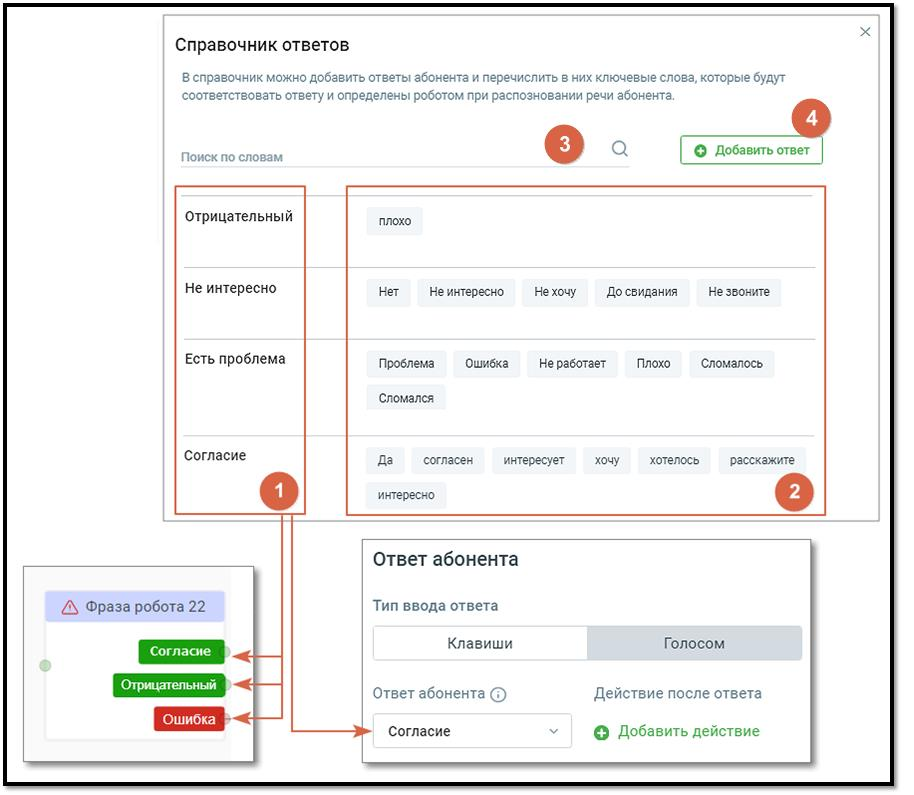
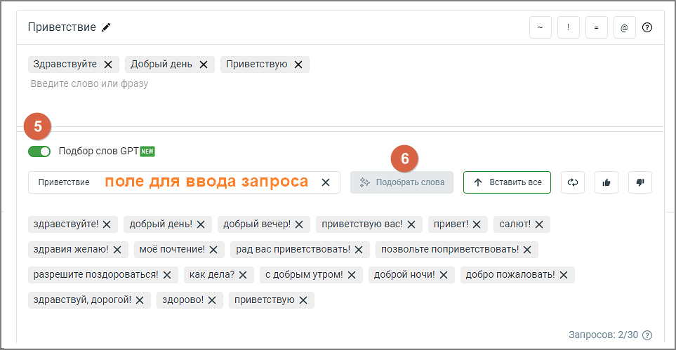
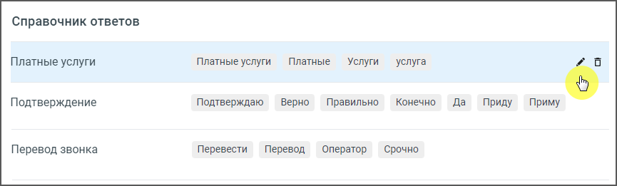

# 8. Справочник ответов

> Трассировка: PDF §8 · сквозные стр. 166-172 · источники: ч.1 `kb/sources/cov-robot-fil/Модуль ЦОВ Робот Фил 2,0_manual_v7.26.28.pdf` с.166-172.

При распознавании речи абонента робот руководствуется Справочником ответов. В Справочнике ответов имеются поле поиска ответов, предустановленные варианты ответов, а также возможность добавлять пользовательские варианты.

| Важно: В отличие от пользовательских, предустановленные варианты ответов не могут быть изменены и удалены |
| --- |
| из Справочника ответов. |

Ответы из Справочника настраиваются в выпадающем списке «Ответ абонента» и используются в блоках Фраза робота, Фраза чат-бота.

Форма Справочника ответов состоит из двух частей: 1) Название блока ответов, прописываемое в скрипте; 2) Ключевые слова блока ответов, которые может произнести абонент. 3) Поле поиска по словам – при вводе символов в поле поиска, названия ответов и ключевые фразы, содержащие введенные символы, в блоках ответов выделяются цветом. В поле поиска нельзя ввести спец.символы. Также на форме Справочника присутствуют:

4) Кнопка «Добавить ответ» – клик по кнопке открывает форму добавления нового ответа, с возможностью использования специальных символов для улучшения распознавания по словарю. Клик по пиктограмме "?" открывает всплывающее окно с пояснениями по их применению. 5) Тумблер Подбор слов GPT– отключен по умолчанию. Включение этой функции предоставляет доступ к подбору слов с помощью GPT, при этом необходимо активировать услугу YandexGPT в разделе "Услуги", нажав на ссылку "Включить услугу". 6) Подобрать слова – функция автоматически подбирает синонимы и альтернативные варианты приветственных фраз на основе запроса. Пользователь может:  Подобрать слова – автоматически обновить список синонимов.  Вставить все – добавить все предложенные варианты в список ответов.  Обновить список запросов – очистка списка и новый подбор слов GPT на основе введенного текста.  Оценить предложения – с помощью кнопок с изображением пальца вверх или вниз можно указать, насколько релевантны предложенные варианты.

Для редактирования или удаления ответа выделите строку блока ответов и нажмите на соответствующую пиктограмму в правой части строки.

В режиме редактирования блока ответов дополнительно доступны:  Кнопка «Сохранить» – сохраняет внесенные в блок изменения.  Кнопка «Отменить» – закрывает редактирования блока, без сохранения изменений. Если при выделении строки пиктограмма «карандаш» не появилась, этот блок ответов относится к предустановленным. Предустановленные блоки ответов не могут быть изменены или удалены. ПРИМЕР Для примера рассмотрим IVR компании, в которой есть отдел продаж, бухгалтерия, отдел доставки. После приветствия робот задает абоненту вопрос «Чем я могу вам помочь?». Абоненты при звонке на такой номер могут произносить следующие фразы  Я хочу заказать окно  Мне нужно согласовать доставку  Мне нужно заказать срочную доставку  Хочу поговорить с менеджером  Вас беспокоит налоговая инспекция  Хочу предложить вам услугу по доставке в офис воды Можно выделить ключевые слова и сгруппировать их по четырем блокам ответов:  Продажи: заказать, менеджер,  Доставка: заказать, доставка  Бухгалтерия: менеджер  Предложения: доставка, вода В блоке ответа перечисляются полные фразы или фрагменты фраз, которые могут произносить или вводить абоненты.

При сопоставлении фраз блока и фраз, введенных абонентом, исключаются предлоги, союзы, междометия и местоимения. По-умолчанию допускается частичное совпадение слов, например («сказала», «сказал» и «сказать»). Предустановленные варианты блоков ответов

|  |  |  |  |
| --- | --- | --- | --- |
|  | Название блока |  | Набор ключевых фраз |
|  | ответов |  |  |
|  |  |  |  |
| Положительный |  |  | да, хорошо, конечно |
| Отрицательный |  |  | нет |
| Интересно |  |  | да, хочу, интересно, конечно, слушаю, хорошо |
| Не интересно |  |  | нет, не интересно, не хочу, до свидания, не звоните |
| Нужна консультация |  |  | консультация, проконсультироваться, не понимаю, есть вопрос, вопрос, выяснить, объясните, объяснить |
| Есть проблема |  |  | проблема, ошибка, не работает, плохо, сломалось, сломался |
| Подтверждение |  |  | подтверждаю, верно, правильно, конечно, да, приду, приму |
| Отмена |  |  | отмена, отменить, не нужно, отказ |

|  |  |  |  |
| --- | --- | --- | --- |
|  | Название блока |  | Набор ключевых фраз |
|  | ответов |  |  |
|  |  |  |  |
| Изменение записи/заказа |  |  | изменить, изменение, другое время, время, перенос, перенести, поменять |

Улучшенное распознавание по словарю Для улучшения распознавания ключевых слов могут применяться специальные символы, с которых должна начинаться распознаваемая фраза (без пробела между символом и фразой): ~ – распознающийся текст должен содержать все слова фразы в любом порядке. Не допускается наличие других слов. Пример: фраза «~да подтверждаю» распознается в тексте «да подтверждаю», «да да подтверждаю да», «подтверждаю да». Не распознается в тексте «подтверждаю да нет». ! – распознающийся текст должен содержать фразу, как подстроку. Наличие других слов допускается. Пример: фраза «!да подтверждаю» распознается в тексте «да подтверждаю», «да да подтверждаю». Не распознается в тексте «подтверждаю да». = – распознающийся текст должен содержать все слова фразы в указанном порядке. Не допускается наличие других слов. Пример: фраза «=да нет» распознается в тексте «да нет», «да нет нет». Не распознается в тексте «нет да». @ – распознаваемая фраза интерпретируется как регулярное выражение. В этом режиме при подсчете совпавших слов считаются и повторяющиеся слова, а также строго проверяется совпадение. Если заданная фраза не содержит специальных символов, то все ее слова должны содержаться в анализируемом тексте в любом порядке. При этом необходимо учитывать состояние чекбокса «Настройки поиска ответа абонента в справочнике» в блоке «Фраза робота».

