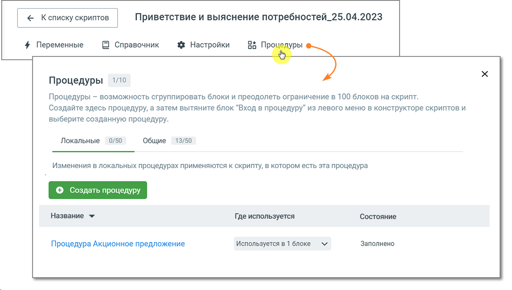
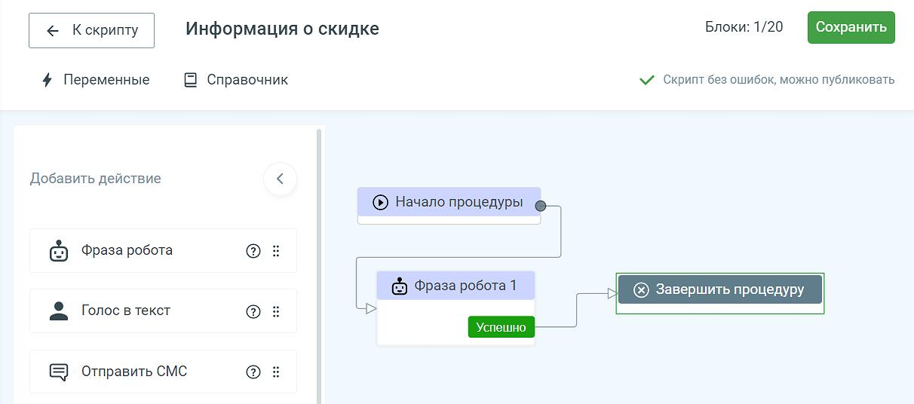

# 9.1. Создание процедуры

> Трассировка: PDF §9.1 · сквозные стр. 172-174 · источники: ч.1 `kb/sources/cov-robot-fil/Модуль ЦОВ Робот Фил 2,0_manual_v7.26.28.pdf` с.172-174.

Для перехода к созданию процедуры откройте поле конструктора скрипта и нажмите на строку подменю «Процедуры». Откроется окно со списком процедур, которые уже созданы на проекте, а также информацией о блоках скрипта, в которых они используются. Существуют локальные и общие процедуры. Локальные используются внутри одного скрипта, тогда как общие позволяют повторно применять логику и обрабатывать данные в разных скриптах. Для создания новой процедуры выберите вариант Локальные или Общие и нажмите кнопку «Создать процедуру». Введите название создаваемой процедуры и нажмите кнопку «Создать». Новая процедура отобразится в списке процедур.

Кликните по наименованию и откройте конструктор процедуры. Новая процедура имеет только нулевой и финальный блоки. Далее необходимо добавить блоки в процедуру, пользуясь конструктором. Процедура создается аналогично скрипту. Максимальное количество добавляемых блоков для одной процедуры – 20. В конструкторе процедуры доступен весь функционал основного скрипта (блоки, справочник, переменные).

Сохраните созданную процедуру кнопкой «Сохранить». Система подскажет о наличии или отсутствии ошибок в созданной процедуре.
