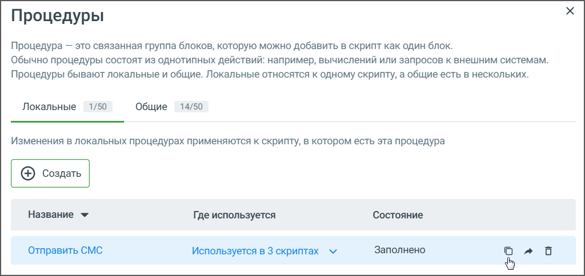

# 9.2. Копирование, перемещение и редактирование процедуры

> Трассировка: PDF §9.2 · сквозные стр. 174-175 · источники: ч.1 `kb/sources/cov-robot-fil/Модуль ЦОВ Робот Фил 2,0_manual_v7.26.28.pdf` с.174-175.

Для копирования процедуры выберите ее в списке и нажмите пиктограмму «Копировать». В списке отобразится новая процедура с пометкой (копия). Клик по наименованию открывает процедуру для редактирования.

Нажатием на иконку выбранной процедуры можно перенести процедуру из Общих в Локальные и наоборот.

Нажав на иконку «стрелка вниз» в столбце «Где используется», можно просмотреть список блоков, в которых используется данная процедура, а также быстро перейти к любому из этих блоков.
