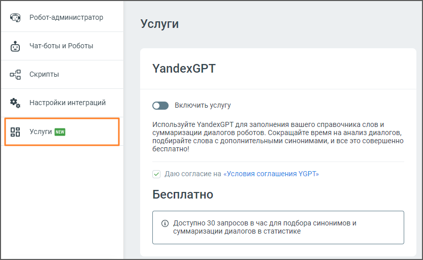

# 10.1. YandexGPT

> Трассировка: PDF §10.1 · сквозные стр. 175-176 · источники: ч.1 `kb/sources/cov-robot-fil/Модуль ЦОВ Робот Фил 2,0_manual_v7.26.28.pdf` с.175-176.

В разделе пользователь может подключить услугу YandexGPT для автоматического пополнения справочника слов и суммаризации диалогов роботов. Это позволит ускорить анализ разговоров и получить подбор синонимов и краткие итоги диалогов.

Элементы интерфейса: 1. Тумблер "Включить услугу" – позволяет активировать или деактивировать услугу YandexGPT. Чтобы включить услугу, установите переключатель в активное положение. 2. Описание услуги – YandexGPT используется для автоматического заполнения справочников слов и суммаризации диалогов чат-ботов. Эта функция помогает сократить время на анализ данных и позволяет автоматически подбирать дополнительные синонимы. 3. Согласие с условиями – перед активацией услуги требуется согласиться с условиями использования YGPT, установив флажок рядом с текстом «Условия соглашения YGPT». 4. Блок "Бесплатно" – сообщает о лимитах бесплатного использования услуги: доступно 30 запросов в час для подбора синонимов и суммаризации диалогов.
