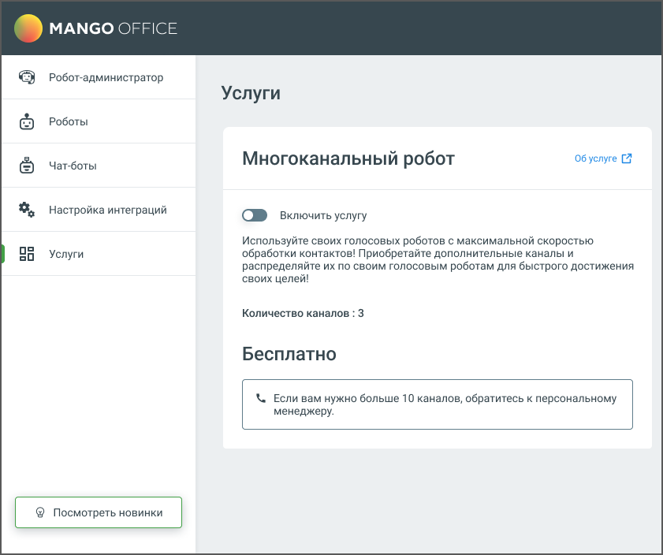

# 10.2. Многоканальный робот

> Трассировка: PDF §10.2 · сквозные стр. 176-177 · источники: ч.1 `kb/sources/cov-robot-fil/Модуль ЦОВ Робот Фил 2,0_manual_v7.26.28.pdf` с.176-177.

В этом разделе можно подключить услугу Многоканальный робот для исходящих коммуникаций, которая позволяет увеличить количество каналов для звонков. Вы можете приобрести дополнительные каналы и распределять их между вашими голосовыми роботами, что ускорит обработку контактов и поможет быстрее достичь поставленных целей. Для увеличения лимита каналов обратитесь к вашему персональному менеджеру.

