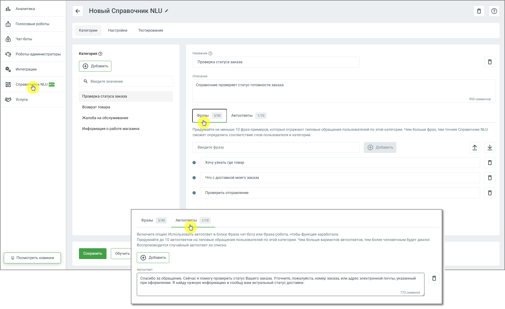
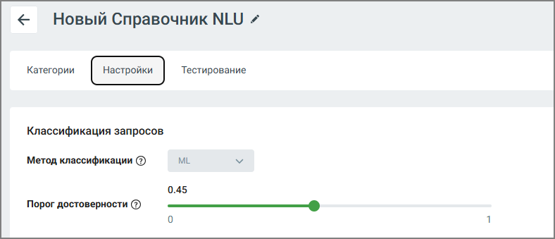
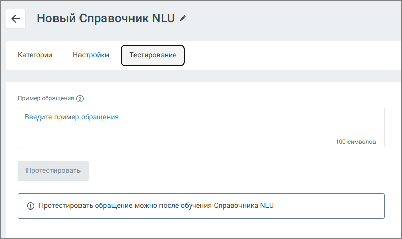

# 11.1. Создание Справочника NLU

> Трассировка: PDF §11.1 · сквозные стр. 178-180 · источники: ч.1 `kb/sources/cov-robot-fil/Модуль ЦОВ Робот Фил 2,0_manual_v7.26.28.pdf` с.178-180.

1. Перейдите в раздел Справочники NLU. 2. Нажмите кнопку Создать. 3. Заполните основные параметры: o Название Справочника o Категории (например: «Баланс», «Тарифы», «Поддержка») o Описание каждой категории o Фразы-примеры – не менее 10 на каждую категорию o Автоответы – случайный ответ из списка, который делает диалог более живым и человечным. Можно задать 10 вариантов.

Чем больше примеров вы добавите, тем точнее Справочник сможет распознавать запросы пользователей.

Работа с категориями Каждая категория отражает определённую тему, с которой обращается клиент. Для обучения робота необходимо указать примеры фраз, соответствующих теме категории. Интерфейс отображает процент совпадения обращения пользователя с каждой категорией – это позволяет администратору оценить, насколько точно робот интерпретирует запрос. Максимальное количество категорий в Справочнике NLU – 40. Настройка модели

Во вкладке Настройки доступны следующие параметры:  Метод классификации (используемая ML-модель)  Порог достоверности – минимальный процент совпадения, при котором обращение будет отнесено к конкретной категории. Например, если порог установлен на уровне 0,5 (50%), то только те фразы, которые совпадают с обучающими примерами не менее чем на 50%, будут отнесены к соответствующей категории. Если совпадение ниже – запрос может быть проигнорирован, классифицирован как «неопределённый» или перенаправлен оператору, в зависимости от сценария.

Тестирование Справочника NLU

Функция тестирования позволяет проверить, как Справочник интерпретирует различные формулировки запросов: 1. Перейдите во вкладку Тестирование 2. Введите пример пользовательской фразы 3. Нажмите Протестировать 4. Система отобразит: o категорию, с которой совпадает запрос o процент совпадения Интеграция в сценарии После обучения Справочник NLU может быть добавлен в готовые сценарии и процедуры. Удаление робота или отдельных категорий будет недоступно до тех пор, пока они используются в активных сценариях.
