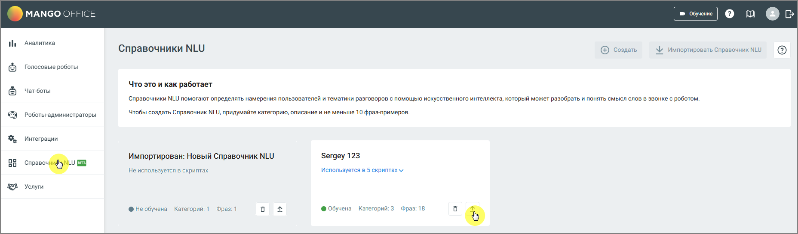

# 11.3. Импорт и экспорт Справочника NLU

> Трассировка: PDF §11.3 · сквозные стр. 182-183 · источники: ч.1 `kb/sources/cov-robot-fil/Модуль ЦОВ Робот Фил 2,0_manual_v7.26.28.pdf` с.182-183.

Функция импорта предназначена для загрузки заранее подготовленного Справочника NLU в формате внутреннего экспорта, используемого для переноса между продуктами (например, в кейсах РКО). Импорт включает не только самого робота, но и связанные данные:  Название,  Категории,  Фразы категорий,  Настройки,  Автоответы для баз знаний. Шаги импорта 1. Перейдите в раздел «Справочники NLU». 2. Нажмите кнопку «Импортировать Справочник NLU». 3. В открывшемся окне выберите файл формата .enc. Перетащите файл в область импорта, или нажмите ссылку «загрузите с диска» и выберите файл вручную. Допустимый размер файла – до 10 МБ. 4. Начнется автоматическая проверка. Если файл содержит ошибки (некорректный формат, битая структура, некорректные спецсимволы) – система отклонит загрузку и выведет уведомление в правом верхнем углу. 5. После успешного импорта Справочник NLU появится в списке, а его название будет дополнено припиской «Импортирован». Выгрузка и импорт фраз категорий В рамках Справочника NLU можно экспортировать и импортировать фразы, привязанные к категориям. Выгрузка:

 Экспортируется CSV-файл, содержащий все фразы, относящиеся к выбранной категории.  Разделитель внутри файла – запятая (,).  Кнопка выгрузки доступна: o В карточке Справочника NLU (для базы знаний), o В разделе «Категории» (для конкретных категорий). Импорт:  При загрузке CSV-файла: o Ошибочные строки отклоняются, весь файл может быть отвергнут при наличии критических ошибок. o Спецсимволы автоматически очищаются (если настроено).  Если количество фраз превышает лимит: o Импортируются только допустимые фразы, o Остальные отбрасываются, o В верхнем правом углу появляется уведомление с количеством загруженных и отброшенных фраз. Экспорт Справочника NLU Для экспорта Справочника NLU нажмите иконку экспорта в его карточке. Справочник со всеми настройками будет экспортирован в формате .enc.

