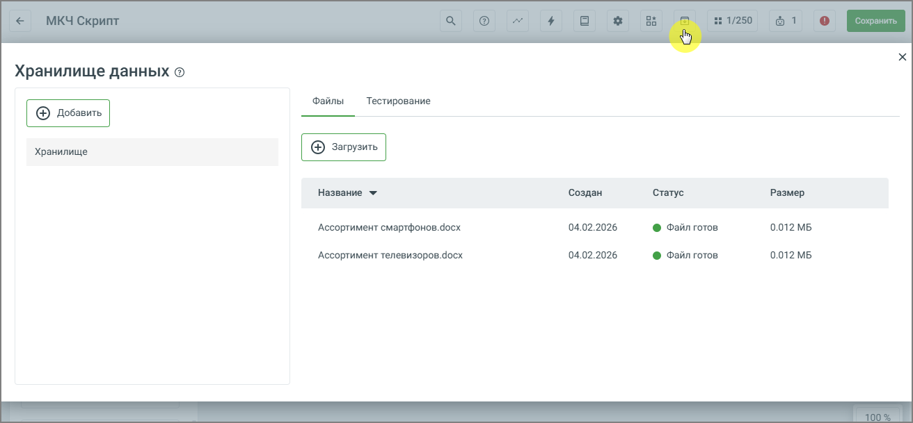

# 11.4. Работа с хранилищем документов (RAG)

> Трассировка: PDF §11.4 · сквозные стр. 183-185 · источники: ч.1 `kb/sources/cov-robot-fil/Модуль ЦОВ Робот Фил 2,0_manual_v7.26.28.pdf` с.183-185.

Раздел «Хранилище документов (RAG)» позволяет подключить к ассистенту ваши собственные материалы – регламенты, инструкции, базы знаний, внутренние методички и другие рабочие документы. Главное преимущество заключается в том, что ответы ассистента начинают опираться не только на общую модель, но и на ваши конкретные данные. Это снижает вероятность неточностей, повышает релевантность и позволяет использовать систему в реальных рабочих сценариях.

Механизм основан на принципе Retrieval-Augmented Generation (RAG). Сначала система анализирует запрос и извлекает из загруженных файлов наиболее подходящие фрагменты, а затем формирует ответ с учётом найденной информации. Таким образом, вы получаете ответы, учитывающие именно ваши документы. Где находится хранилище Доступ к хранилищу осуществляется через Конструктор скриптов – раздел расположен в верхней панели интерфейса.

Работа с RAG начинается с создания хранилища. Хранилище – это отдельное, изолированное пространство, в котором индексируются и используются ваши документы. После перехода в раздел достаточно создать новое хранилище, задать ему имя и сохранить настройки. Рекомендуется выбирать понятное название – например, по проекту, подразделению или типу документов. Это особенно важно, если вы планируете использовать несколько хранилищ параллельно. Несколько хранилищ можно создавать для разных задач: одно – для клиентской поддержки, другое – для внутреннего обучения, третье – для технической документации. Они не пересекаются между собой и работают независимо. Как загрузить документы После создания хранилища становится доступна загрузка файлов. Вы выбираете документ с локального устройства и подтверждаете загрузку. Далее система автоматически:

 обрабатывает файл,  разбивает текст на фрагменты,  индексирует содержимое,  делает его доступным для поиска. После завершения индексации ассистент сможет использовать данные из документа при формировании ответов. Важно понимать: документы не просто «прикрепляются» к запросу, а становятся частью интеллектуального поиска. Это значит, что система будет извлекать только те фрагменты, которые действительно относятся к вопросу пользователя. Как система формирует ответ Общая логика работы выглядит следующим образом: 1. Пользователь создаёт хранилище и загружает документы. 2. При поступлении запроса система анализирует его содержание. 3. Из хранилища извлекаются наиболее релевантные фрагменты. 4. Модель формирует ответ с учётом найденной информации. Если подходящие данные в документах отсутствуют, используется стандартный механизм генерации ответа без обращения к хранилищу. Таким образом, RAG расширяет возможности ассистента: он продолжает работать как универсальная модель, но при необходимости опирается на ваши конкретные источники.
