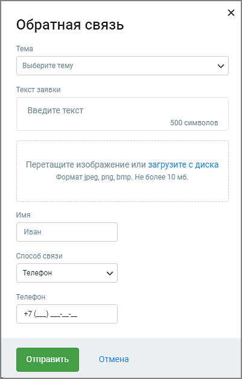

# 13. Форма обратной связи

> Трассировка: PDF §13 · сквозные стр. 194-195 · источники: ч.1 `kb/sources/cov-robot-fil/Модуль ЦОВ Робот Фил 2,0_manual_v7.26.28.pdf` с.194-195.

Нажав на пиктограмму в правом верхнем углу главного окна модуля Роботы пользователь может отправить свой вопрос, сообщение о проблеме или необходимости доработки продукта, чтобы как можно быстрее получить обратную связь или решение вопроса.

Заполните поля формы и нажмите кнопку Отправить. Ответ службы поддержки поступит на выбранный при заполнении формы способ связи.
