# 3. Дополнительные настройки интеграции

> Трассировка: PDF §3 · сквозные стр. 17-29 · источники: ч.1 `kb/sources/integration_1c/Integratsiya_virtualnoy_ats_Pryamaya_integraciya_s_1C.pdf` с.17-29.

В зависимости от ваших задач, укажите дополнительные настройки интеграции на вкладке «Параметры» в приложении 1С.

## 3.1 Обработка звонков

Распределение вызовов по ответственным сотрудникам Если настройка включена, то звонок, поступивший от Клиента (чей контакт ранее уже был сохранен в 1С) будет сразу перенаправлен на ответственного сотрудника. Вы можете включить настройку «Учитывать статус сотрудника при распределении». В этом случае, если ответственный сотрудник разговаривает, то входящий звонок от Клиента останется в IVR и не будет переведен на ответственного. Чтобы включить распределение вызовов, выполните следующие действия: 1) активируйте переключатель «Распределять вызовы от Клиентов по ответственным сотрудникам»; 2) активируйте переключатель «Учитывать статус сотрудника при распределении», при необходимости; 3) сохраните настройки, нажав одноименную кнопку внизу формы «Настройки интеграции ВАТС «Mango office»:

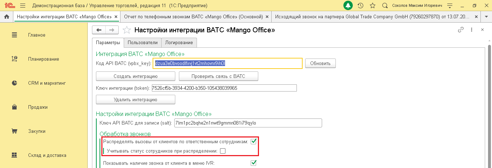

Рисунок 26 Показывать наличие звонка от Клиента в меню IVR Позвонив вам, Клиент сначала попадает в IVR-меню, затем звонок направляется на сотрудника. 17 5Прямая интеграция с системой «1С: Управление торговлей» Редакция 11 (11.3 - 11.4, 11.5) | Версия от 22.12 .2025 Если данная настройка включена, то, как только звонок поступает в IVR-меню, информация о нем отображается на экране сотруднику, первому зарегистрировавшемуся в сессии интеграции (то есть, например, первому сотруднику, вошедшему в 1С в начале рабочего дня).

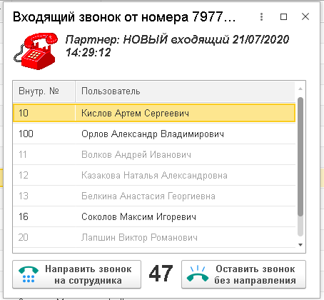

Рисунок 27 Важно: 1) сотрудникам, зарегистрировавшимся в сессии интеграции вторым и последующим (вошедшим в 1с вторым и последующим), информация о звонке в IVR-меню не будет выводиться на экран; 2) в настройке учитывается статус пользователя. Если первый зарегистрированный сотрудник свободен (не разговаривает по телефону), то, при поступлении звонка в IVR, этот пользователь увидит на экране окно «Входящий звонок от номера…» и сможет направить звонок на себя или другого свободного сотрудника. Чтобы настроить показ информации о звонке в IVR, выполните следующие действия: 1) активируйте переключатель «Показывать наличие звонка от Клиентов в меню IVR»; 2) сохраните настройки, нажав одноименную кнопку внизу вкладки «Параметры»: 18 5Прямая интеграция с системой «1С: Управление торговлей» Редакция 11 (11.3 - 11.4, 11.5) | Версия от 22.12 .2025

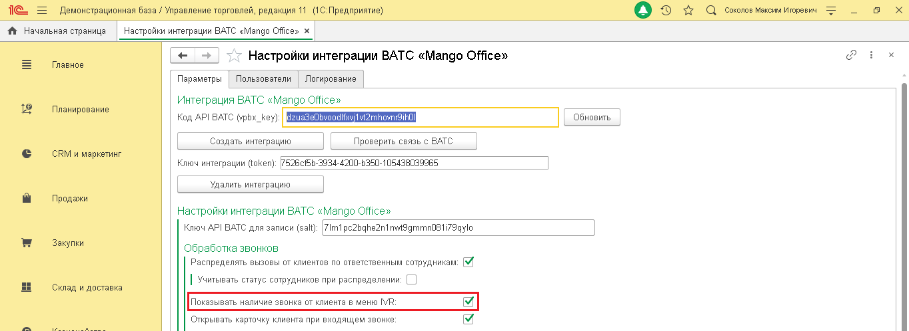

Рисунок 28 Открывать карточку Клиента при входящем звонке Если эта настройка включена, то при входящем звонке от Клиента в интерфейсе 1С будет показана карточка Клиента:

Рисунок 29 Чтобы включить данную настройку, выполните следующие действия: 1) активируйте переключатель «Открывать карточку Клиента при входящем звонке»; 2) сохраните настройки, нажав одноименную кнопку внизу формы «Настройки интеграции ВАТС «Mango office»: 19 5Прямая интеграция с системой «1С: Управление торговлей» Редакция 11 (11.3 - 11.4, 11.5) | Версия от 22.12 .2025

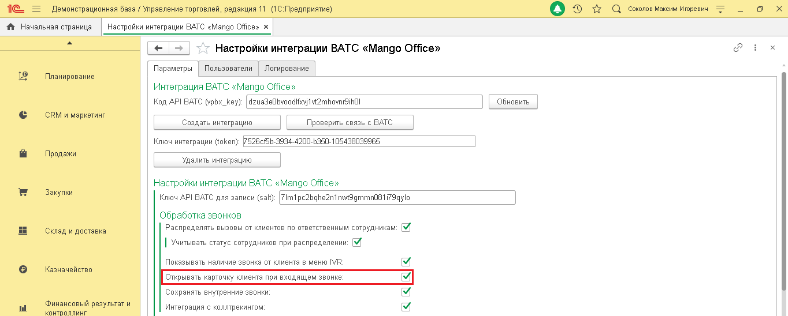

Рисунок 30 Сохранять внутренние звонки Внутренние звонки, это звонки одного вашего сотрудника, совершенные через Виртуальную АТС, другому сотруднику. Настройка «Сохранять внутренние звонки» позволяет передавать данные о внутренних звонках отчет по телефонным звонкам. Чтобы включить данную настройку, выполните следующие действия: 1) активируйте переключатель «Сохранять внутренние звонки»; 2) сохраните настройки, нажав одноименную кнопку внизу формы «Настройки интеграции ВАТС «Mango office»:

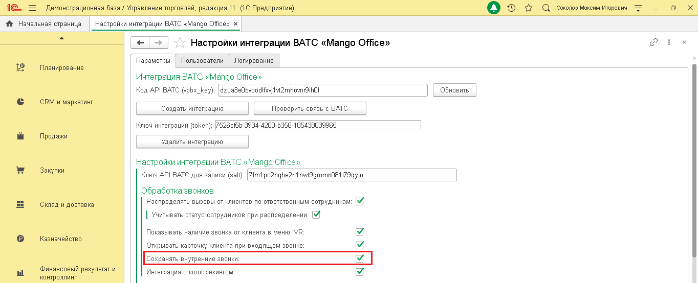

Рисунок 31 Интеграция с коллтрекингом Если ранее вы подключили Коллтрекинг к вашей Виртуальной АТС, то вы можете включить сохранение данных коллтрекинга в 1С. Это позволит вам видеть в 1С следующую информацию: 20 5Прямая интеграция с системой «1С: Управление торговлей» Редакция 11 (11.3 - 11.4, 11.5) | Версия от 22.12 .2025

| Поле | Описание |
| --- | --- |
| ДКТ: client_id | Уникальный id посетителя |
| ДКТ: client_сid | Google CID |
| ДКТ: ya_client_id | Уникальный id Клиента в сервисе Яндекс.Метрика |
| ДКТ: Город | Город, откуда посетитель. Если не указан, то сохраняется ISO код страны |
| ДКТ: Источник | Источник, utm_source |
| ДКТ: Канал | Канал, utm_medium |
| ДКТ: Кампания | Рекламная кампания, utm_ campaign |
| ДКТ: Содержимое | Содержимое, utm_content |
| ДКТ: Что искал | Что искал, utm_term |
| ДКТ: Время на сайте | Время посетителя на сайте с момента входа на сайт, сек. |
| ДКТ: Страница звонка | Текущая страница посетителя (на которой отобразился номер коллтрекинга) |
| ДКТ: Контекст вызова | id контекста вызова, служебный параметр |
| ДКТ: Custom | Дополнительные параметры, передаваемые в код виджета тем, кто разместил его на сайте. |
| ДКТ: Имя виджета | Имя виджета коллтрекинга |
| ДКТ: Тип заявки | Тип заявки (форма с сайта и другие) |
| roistat | Уникальный id обращения из Roistat. Заполняется только если включена интеграция с Roistat |
| ДКТ: Тип звонка | Тип звонка: статический / динамический |
| ДКТ: device | Тип устройства, с которого посетитель перешел на ваш сайт: настольный ПК, планшет, мобильный телефон, не определено. |
| ДКТ: новый пользователь | Признак нового пользователя |

В Личном кабинете Виртуальной АТС вы cможете использовать отчеты коллтрекинга, кроме Сквозной аналитики. Примечание. Интеграция не поддерживает передача данных из 1С в Сквозную аналитику. В отчете по звонкам в 1С появится возможность отбирать абонентов по рекламным кампаниям, по городам и другим параметрам. Вы сможете выявить и отказаться от неэффективных кампаний, каналов, ключевых слов и инвестировать средства в наиболее эффективные объявления и баннеры. 21 5Прямая интеграция с системой «1С: Управление торговлей» Редакция 11 (11.3 - 11.4, 11.5) | Версия от 22.12 .2025 Примечание. Если вы отключите настройку сохранения данных коллтрекинга, то все накопленные данные сохранятся в 1С. Чтобы включить сохранение данных коллтрекинга, выполните следующие действия: 1) активируйте переключатель «Интеграция с коллтрекингом»; 2) сохраните настройки, нажав одноименную кнопку внизу формы «Настройки интеграции ВАТС «Mango office»:

Рисунок 32

## 3.2 Автоматическое создание Клиентов

С помощью этой настройки вы сможете разрешить или запретить автоматическое создание Клиентов в 1С как при входящих, так и при исходящих звонках с новых номеров. Вы можете выбрать тип создаваемого Клиента: Партнер, Контрагент И/ИЛИ Партнер, Контактное лицо партнера И Партнер, Физическое лицо. Важно! Если данная настройка включена, то Клиент будет создан в 1С даже, если звонок не принят сотрудником, и в созданный документ звонка будет подставлен в поле «Абонент» в документе «Телефонный звонок». Чтобы настроить автоматическое создание Клиентов, выполните следующие действия: 22 5Прямая интеграция с системой «1С: Управление торговлей» Редакция 11 (11.3 - 11.4, 11.5) | Версия от 22.12 .2025 1) активируйте переключатель «Создавать нового Клиента при входящих звонках», чтобы в 1С автоматически заводился новый Клиент при поступлении звонка. Затем нужно установить следующие настройки: - Звонки в голосовом меню назначать на: укажите сотрудника, на которого будут назначаться звонки, попавшие в IVR. Вы можете выбрать не только пользователя интеграции с 1С, но и любого другого сотрудника, зарегистрированного в 1С; - Пропущенные звонки назначать на: выберите сотрудника, на которого будут назначаться пропущенные звонки. Вы можете выбрать не только пользователя интеграции с 1С, но и любого другого сотрудника, зарегистрированного в 1С; 2) активируйте переключатель «Создавать нового Клиента при исходящих звонках», чтобы в 1С автоматически заводился новый Клиент при исходящем звонке; 3) выберите тип создаваемого Клиента; 4) сохраните настройки, нажав одноименную кнопку внизу формы «Настройки интеграции ВАТС «Mango office»:

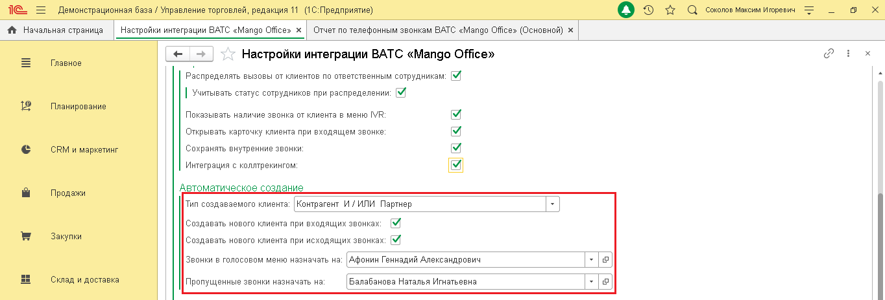

Рисунок 33

## 3.3 Обработка звонков при сохранении

На обработку звонков при сохранении их в 1С влияют параметры: - длительность успешно принятых звонков; - длительность успешно дозвонившихся. Успешно принятый звонок – это входящий звонок, длительность разговора в котором не менее определенного значения, например, не менее 2-х секунд. Звонки с длительностью разговора менее указанного значения, будут считаться не принятыми. Минимальная длительность успешно принятого звонка по умолчанию равна 0 секунд. Если минимальная длительность равна нулю, это означает, что все входящие звонки будут считаться успешными. Вы можете указать минимальную длительность от 0 до 9 999 секунд. Успешно дозвонившиеся – это исходящий звонок, длительность разговора в котором не менее определенного значения. По умолчанию длительность разговора успешно дозвонившихся равна 0 секунд, значит все исходящие звонки считаются успешно дозвонившимися. Вы можете задать минимальную длительность от 0 до 9 999. 23 5Прямая интеграция с системой «1С: Управление торговлей» Редакция 11 (11.3 - 11.4, 11.5) | Версия от 22.12 .2025 Чтобы настроить обработку звонков при сохранении, в форме «Настройки интеграции ВАТС «MANGO OFFICE»: 1) укажите минимальную длительность в секундах для успешно принятых звонков в одноименном поле; 2) укажите минимальную длительность для успешно дозвонившихся в одноименном поле; 3) нажмите кнопку «Сохранить настройки»:

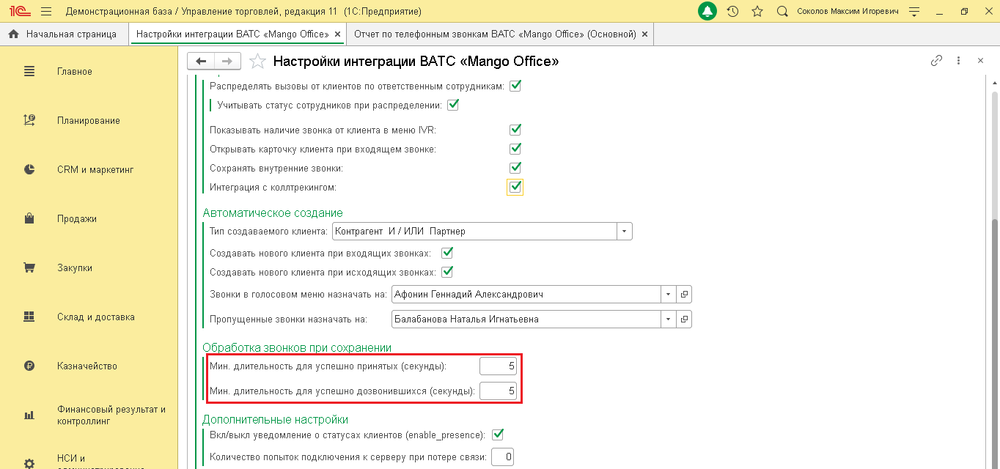

Рисунок 34 24 5Прямая интеграция с системой «1С: Управление торговлей» Редакция 11 (11.3 - 11.4, 11.5) | Версия от 22.12 .2025

## 3.4 Управление пользователями интеграции 1С

Информация о пользователях Чтобы открыть информацию о пользователях, нажмите на кнопку «Управление пользователями» на вкладке «Пользователи»:

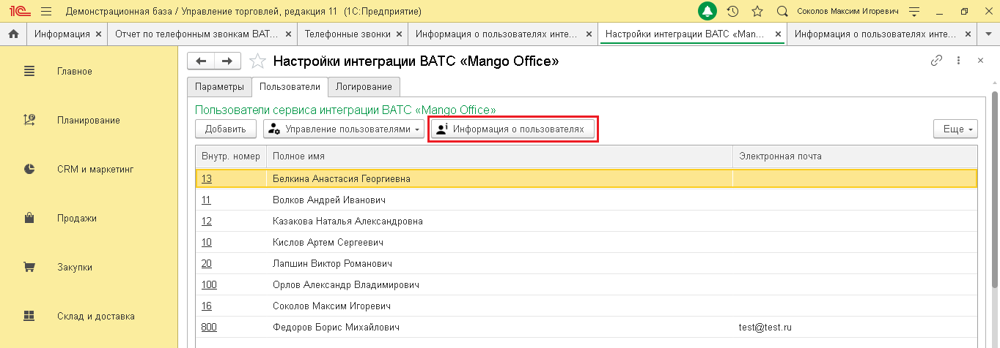

Рисунок 35 Будет открыт список пользователей прямой интеграции с 1С. Вы можете сохранить список в

файл или распечатать его, кнопки в правом верхнем углу списка:

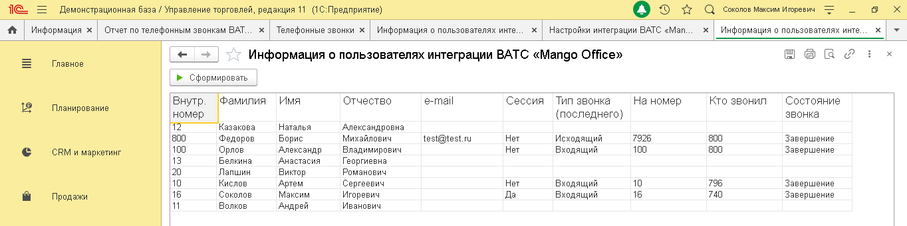

Рисунок 36 25 5Прямая интеграция с системой «1С: Управление торговлей» Редакция 11 (11.3 - 11.4, 11.5) | Версия от 22.12 .2025 Как добавить пользователя Управляйте количеством пользователей прямой интеграции 1С с Виртуальной АТС прямо из Личного кабинета MANGO OFFICE. Изменить количество пользователей интеграции можно в любое время. Чтобы изменить количество пользователей, выполните следующие действия: 1) откройте ваш Личный кабинет MANGO OFFICE; 2) перейдите в раздел «Интеграции»; 3) нажмите кнопку «Изменить» в блоке прямой интеграции с 1С:

Рисунок 37 4) укажите, сколько ваших сотрудников будут пользоваться интеграцией с 1С. Минимальное количество – 3 пользователя; 5) нажмите кнопку «Сохранить». Будет изменено количество пользователей прямой интеграции с 1С; 6) для новых пользователей интеграции нужно настроить сопоставление пользователей 1С и внутренних номеров Виртуальной АТС.

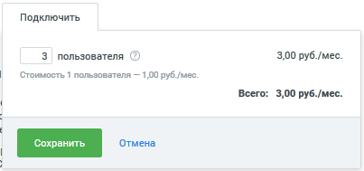

Рисунок 38 26 5Прямая интеграция с системой «1С: Управление торговлей» Редакция 11 (11.3 - 11.4, 11.5) | Версия от 22.12 .2025 Как изменить внутрениий номер ВАТС Для того, чтобы изменить у пользователя 1С внутренний номер ВАТС, выполните следующие действия: 1) перейдите в ваш 1С; 2) перейдите в административный раздел «Интеграция ВАТС «Mango office»; 3) нажмите на ссылку «Настройки интеграции»; 4) перейдите на вкладку «Пользователи» в открывшейся форме «Настройки интеграции ВАТС «MANGO OFFICE»; 5) дважды кликните на ячейку «Внутр. Номер» в строке с данными сотрудника; 6) введите внутренний номер вашей Виртуальной АТС и нажмите кнопку «Ок» в открывшейся форме:

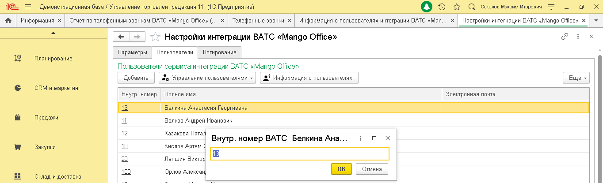

Рисунок 39 27 5Прямая интеграция с системой «1С: Управление торговлей» Редакция 11 (11.3 - 11.4, 11.5) | Версия от 22.12 .2025 Удаление внутреннего номера Чтобы удалить внутренний номер у пользователя прямой интеграции с 1С, выполните следующие действия: 1) нажмите на кнопку «Управление пользователями» на вкладке «Пользователи»; 2) выберите пункт «Удалить внутренний номер»:

Рисунок 40 3) нажмите кнопку «Ок»:

Рисунок 41 28 5Прямая интеграция с системой «1С: Управление торговлей» Редакция 11 (11.3 - 11.4, 11.5) | Версия от 22.12 .2025
