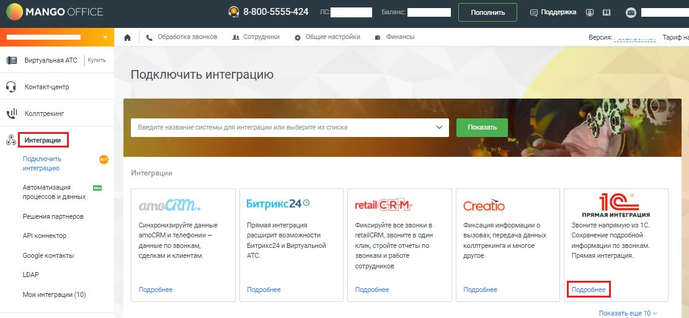
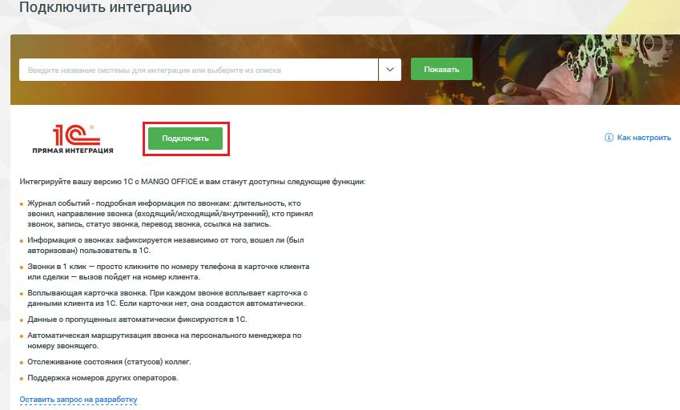
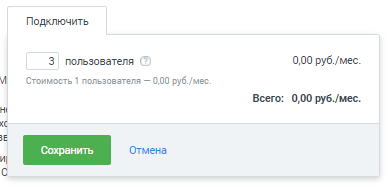
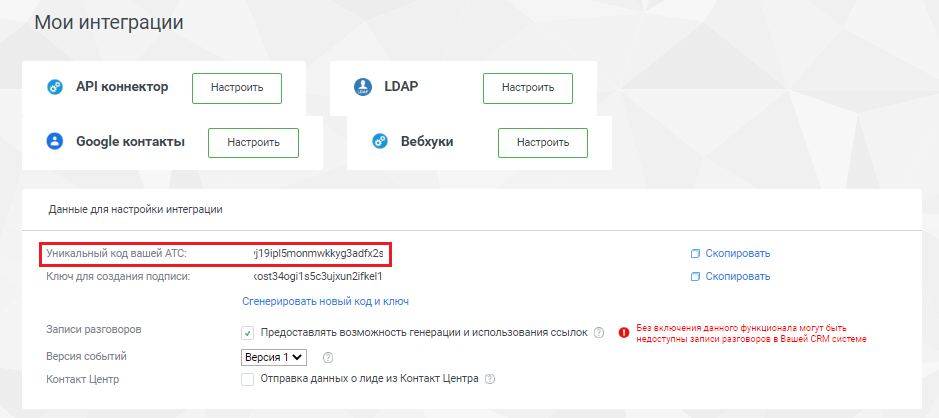

# Шаг 3. Подключение виджета интеграции в Личном кабинете MANGO OFFICE

> Трассировка: PDF §2 · сквозные стр. 5-7 · источники: ч.1 `kb/sources/integration_1c/Integratsiya_virtualnoy_ats_Pryamaya_integraciya_s_1C.pdf` с.5-7.

MANGO OFFICE Для того чтобы подключить виджет прямой интеграции с 1С, следует: 1) войдите в Личный кабинет Виртуальной АТС; 2) выберите вашу Виртуальную АТС и перейдите в раздел «Интеграции»; 3) нажмите кнопку «Подробнее» в блоке «1С. Прямая интеграция»:

Рисунок 1 4) нажмите кнопку «Подключить»: 5Прямая интеграция с системой «1С: Управление торговлей» Редакция 11 (11.3 - 11.4, 11.5) | Версия от 22.12 .2025

Рисунок 2 5) выберите количество сотрудников, которые будут использовать прямую интеграцию. Минимальное количество – 3 человека; 6) нажмите кнопку «Сохранить»:

Рисунок 3 7) сохраните к себе (например, скопируйте в Блокнот) уникальный код вашей Виртуальной АТС, он пригодится далее при настройке интеграции в 1С:

Рисунок 4 5Прямая интеграция с системой «1С: Управление торговлей» Редакция 11 (11.3 - 11.4, 11.5) | Версия от 22.12 .2025
