# Шаг 4. Настройка интеграции в 1С

> Трассировка: PDF §2 · сквозные стр. 7-17 · источники: ч.1 `kb/sources/integration_1c/Integratsiya_virtualnoy_ats_Pryamaya_integraciya_s_1C.pdf` с.7-17.

Подключение расширения конфигурации Для подключения расширения конфигурации, выполните следующие действия: 1) запустите и авторизуйтесь в Конфигураторе 1С; 2) выберите пункт меню «Конфигурация», затем пункт «Расширения конфигурации»:

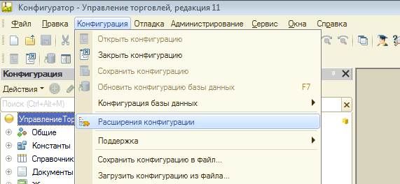

Рисунок 5 3) нажмите кнопку «Действия», затем выберите пункт «Добавить» в блоке «Расширения конфигурации»:

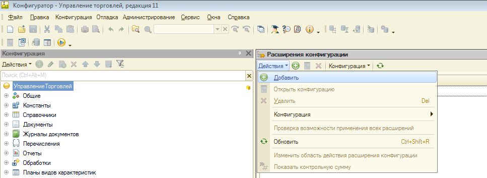

Рисунок 6 4) укажите удобное для идентификации название расширения:

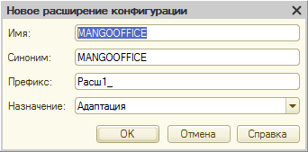

Рисунок 7 5) в строке с данными расширения "MANGOOFFICE" снимите следующие «галочки»: 5Прямая интеграция с системой «1С: Управление торговлей» Редакция 11 (11.3 - 11.4, 11.5) | Версия от 22.12 .2025 - Безопасный режим; - Защита от опасных действий;

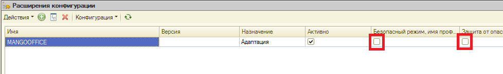

Рисунок 8 Примечание. Функции "Безопасный режим" и "Защита от опасных действий" в 1С накладывают определенные ограничения на использование тех или иных методов программного кода. Например, ограничения на использование в методов Выполнить() и Вычислить(). Данные функции предназначены для обеспечения безопасности системы в целом, при запуске внешней конфигурации. Если установка расширения "MANGOOFFICE" выполняется при включенном безопасном режиме и включенной защите от опасных действий, то это расширение не будет работать в 1С. Чтобы избежать выдачи сообщения об ошибке в 1С, следует выключить "Безопасный режим" и функцию "Защита от опасных действий". 6) загрузите файл с расширением конфигурации:

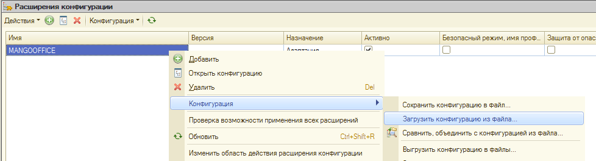

Рисунок 9 7) укажите расширение конфигурации; 5Прямая интеграция с системой «1С: Управление торговлей» Редакция 11 (11.3 - 11.4, 11.5) | Версия от 22.12 .2025 Важно! Используйте разные расширения конфигурации для разных версий 1С:

| Версия 1С | Имя файла, содержащего расширение конфигурации | Ссылка для скачивания с сайта MANGO OFFICE |
| --- | --- | --- |
| 1С: Управление торговлей. Версии 11.3 -11.4 | MangoOffice_UT114_210117.zip | Скачать |
| 1С: Управление Торговлей. Версии 11.5 | MangoOffice_UT115_210120.zip | Скачать |

8) подтвердите необходимость добавления расширения:

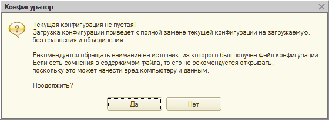

Рисунок 10

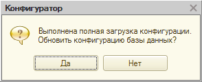

Рисунок 11 9) система «1С» выполнит и подтвердит обновление, после чего нажмите кнопку «Принять»:

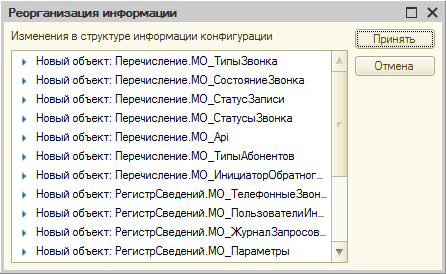

Рисунок 12 10) расширение установлено, можно запускать 1С; 11) в состав расширения входит внешнее расширение, реализующее работу с сервером API. При запуске 1С оно автоматически устанавливается в папку: C:\Users\<имя_пользователя>\AppData\Roaming\1C\1cv8\ExtCompT 5Прямая интеграция с системой «1С: Управление торговлей» Редакция 11 (11.3 - 11.4, 11.5) | Версия от 22.12 .2025 Файл MangoOfficeSDK.dll (для 32-битной версии 1С) или MangoOfficeSDK64.dll (для 64- битной версии 1С). Также, в этой же папке должен быть файл registry.xml, в котором должен быть прописан файл расширения. Пример:

| <?xml version="1.0" encoding="UTF-8"?> |
| --- |
| <registry xmlns="http://v8.1c.ru/8.2/addin/registry"> |
| <component path="MangoOfficeSDK64.dll" type="native"/> |
| </registry> |

12) после первого запуска 1С выдается сообщение:

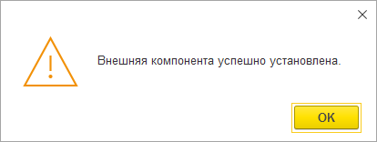

Рисунок 13 Настройка первичного подключения интеграции Чтобы настроить прямую интеграцию, выполните: 1) перейдите в ваш 1С; 2) перейдите в административный раздел «Интеграция ВАТС «Mango office»; 5Прямая интеграция с системой «1С: Управление торговлей» Редакция 11 (11.3 - 11.4, 11.5) | Версия от 22.12 .2025 3) нажмите на ссылку «Настройки интеграции»:

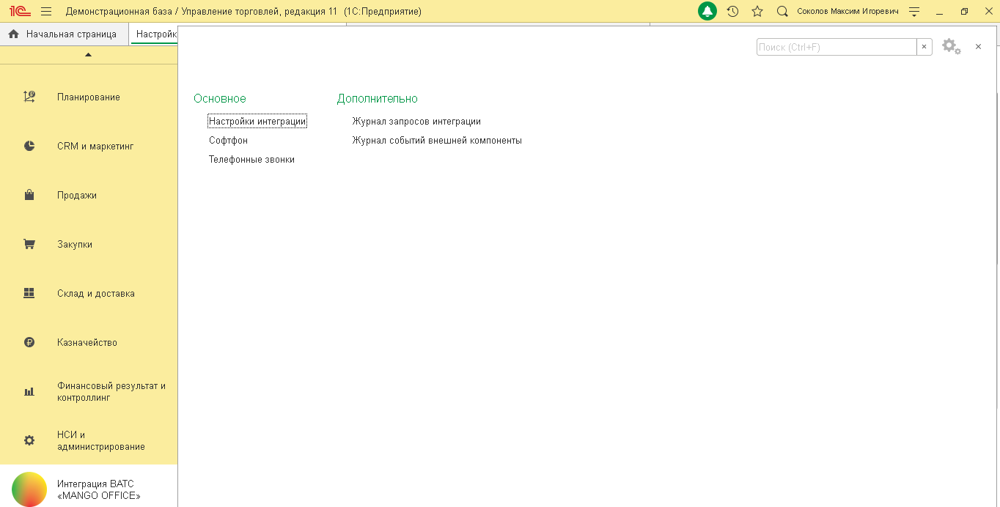

Рисунок 14 4) откройте вкладку «Параметры» в открывшейся форме «Настройки интеграции ВАТС «MANGO OFFICE»; 5) вставьте код вашей ВАТС в поле «Код ВАТС (vpbx_key)». Примечание. Код Виртуальной АТС и ключ для создания подписи вы получили ранее, при подключении виджета интеграции в Личном кабинете MANGO OFFICE.

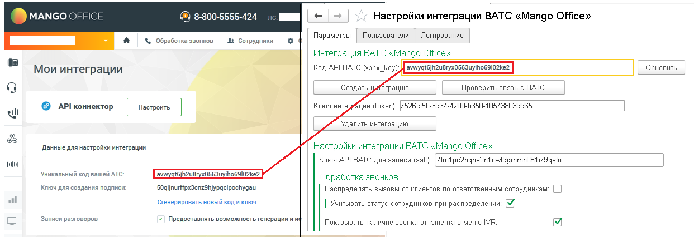

Рисунок 15 6) нажмите кнопку «Создать интеграцию». Будут показаны настройки интеграции на вкладке «Параметры»: 5Прямая интеграция с системой «1С: Управление торговлей» Редакция 11 (11.3 - 11.4, 11.5) | Версия от 22.12 .2025

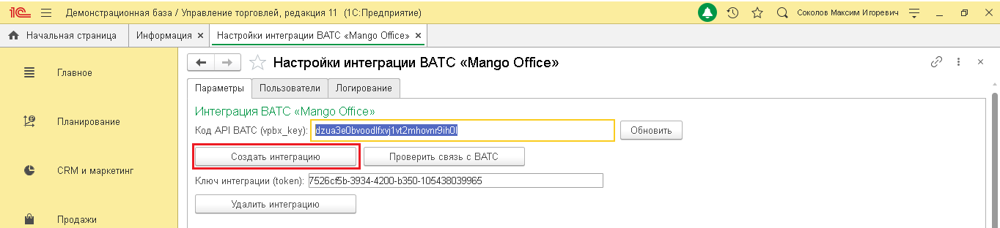

Рисунок 16 7) нажмите кнопку «Сохранить настройки» (кнопка расположена внизу на вкладки «Параметры»):

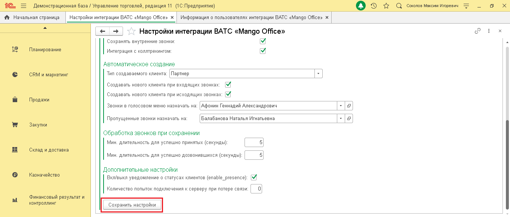

Рисунок 17 8) проверьте, доступен ли сервер интеграции, нажав кнопку «Проверить связь с ВАТС»:

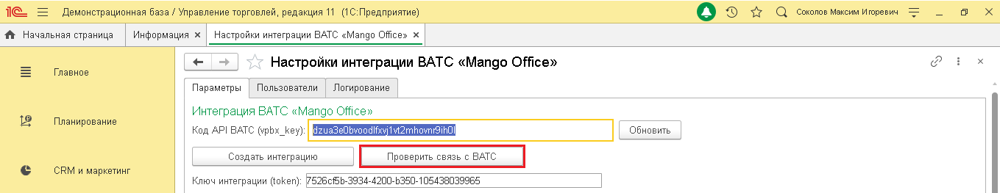

Рисунок 18 Если связь установлена, то будет выдано сообщение «Сервер интеграции доступен»: 5Прямая интеграция с системой «1С: Управление торговлей» Редакция 11 (11.3 - 11.4, 11.5) | Версия от 22.12 .2025

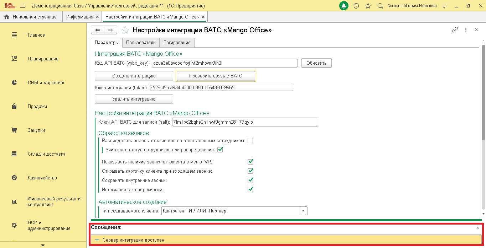

Рисунок 19 После успешного подключения интеграции вам нужно присвоить внутренние телефонные номера пользователям 1С. После этого, вы можете установить дополнительные настройки обработки звонков. Как указать сопоставление пользователей 1С и внутренних номеров Виртуальной АТС После того, как вы подключили виджет прямой интеграции и настроили интеграцию в 1С, нужно присвоить сотрудникам, зарегистрированным в 1С, внутренние номера Виртуальной АТС. Тогда эти сотрудники смогут пользоваться прямой интеграцией. Важно! В прямой интеграции с 1С вы сами определяете ограничение на максимальное количество пользователей. Не гарантирована обработка звонков пользователей сверх установленных пределов. Если лимит на количество пользователей превышен, то будет выдано сообщение об ошибке и передача данных о звонках в 1С будет ограничена. Чтобы решить эту проблему, вы можете увеличить количество пользователей прямой интеграции. Чтобы присвоить внутренние номера сотрудникам в 1С нужно: 1) откройте вкладку «Пользователи» в форме «Настройки интеграции ВАТС «MANGO OFFICE»; 2) нажмите кнопку «Добавить»; 5Прямая интеграция с системой «1С: Управление торговлей» Редакция 11 (11.3 - 11.4, 11.5) | Версия от 22.12 .2025 Примечание. Список пользователей можно сортировать по возрастанию или убыванию значения в том или ином столбце. Для этого нужно кликнуть на заголовок (шапку) столбца.

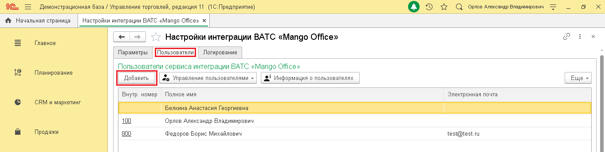

Рисунок 20 3) в открывшейся форме «Выбор пользователя» дважды кликните на фамилию сотрудника, которому нужно выдать номер:

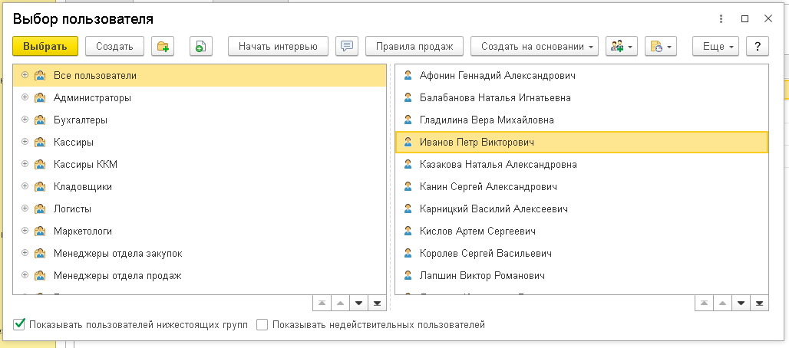

Рисунок 21 4) выбранный пользователь будет добавлен в список на вкладке «Пользователи». Дважды кликните на ячейку «Внутр. Номер» в сроке с данными сотрудника; 5) введите внутренний номер сотрудника, указанный в карточке сотрудника в Личном кабинете MANGO OFFICCE и нажмите кнопку «Ок» в открывшейся форме; 6) выполните шаги 2-5 для всех сотрудников, которые будут пользоваться прямой интеграцией:

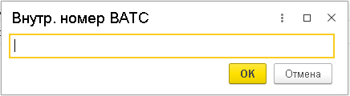

Рисунок 22 Устранение ошибки при подключении расширения конфигурации При добавлении расширения конфигурации выдано следующее сообщение об ошибке? 5Прямая интеграция с системой «1С: Управление торговлей» Редакция 11 (11.3 - 11.4, 11.5) | Версия от 22.12 .2025

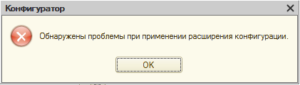

Рисунок 23 Расширение конфигурации может не работать по следующим причинам: 1) расширение конфигурации подключено в безопасном режиме; 2) пользователю 1С не выданы права доступа. Расширение подключено в безопасном режиме В случае установки расширения в безопасном режиме, это расширение не будет работать в 1С. Чтобы проверить режим установки расширения, необходимо: 1) откройте Конфигуратор 1С; 2) выберите пункт меню «Конфигурация», затем пункт «Расширения конфигурации»: 3) убедитесь, что в строке с данными расширения «MANGOOFFICE» сняты следующие «галочки»: - Безопасный режим; - Защита от опасных действий. Примечание. Если «галочки» установлены, то снимите их.

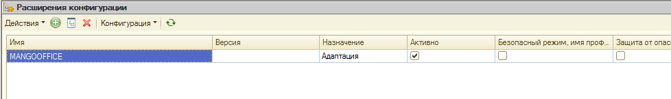

Рисунок 24 4) вам нужно перезапустить ваш 1С. Пользователю 1С не выданы права доступа Если, при подключении конфигурации, выдано сообщение об ошибке, убедитесь, что пользователю 1С присвоена роль «ВАТС Mango Office». Чтобы открыть список пользователей, в окне "Конфигуратор" нужно нажать на пункт меню "Администрирование". В открывшемся выпадающем меню нужно выбрать пункт "Пользователи". Будет открыто окно "Список пользователей", в котором дважды нажмите на 5Прямая интеграция с системой «1С: Управление торговлей» Редакция 11 (11.3 - 11.4, 11.5) | Версия от 22.12 .2025 строку с именем нужного вам пользователя. Будет открыто окно "Пользователь", в котором нужно открыть закладку "Пользователь" и проверить активацию пункта "ВАТС Mango Office":

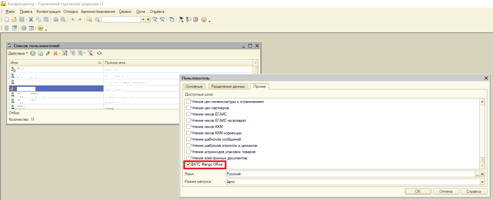

Рисунок 25 Примечание. Если в строке «ВАТС Mango Office» не установлена «галочка», то установите ее. Затем, вам нужно перезапустить ваш 1С. 5Прямая интеграция с системой «1С: Управление торговлей» Редакция 11 (11.3 - 11.4, 11.5) | Версия от 22.12 .2025
