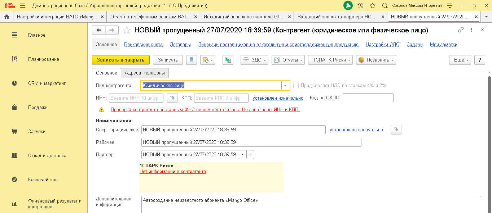
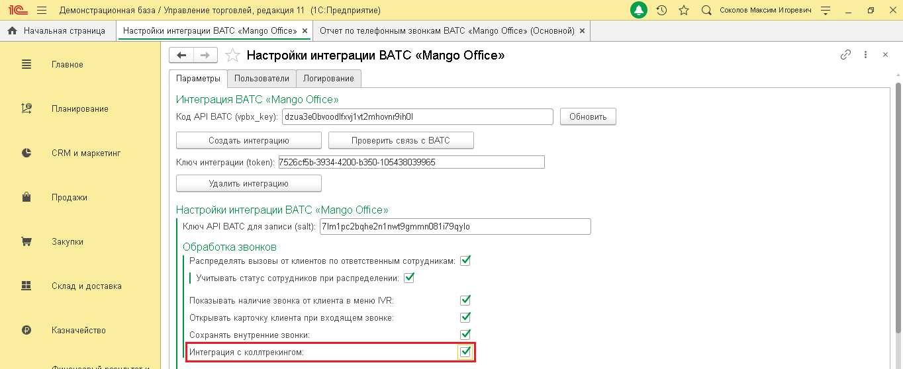

# 3.1. Обработка звонков

> Трассировка: PDF §3.1 · сквозные стр. 17-22 · источники: ч.1 `kb/sources/integration_1c/Integratsiya_virtualnoy_ats_Pryamaya_integraciya_s_1C.pdf` с.17-22.

Распределение вызовов по ответственным сотрудникам Если настройка включена, то звонок, поступивший от Клиента (чей контакт ранее уже был сохранен в 1С) будет сразу перенаправлен на ответственного сотрудника. Вы можете включить настройку «Учитывать статус сотрудника при распределении». В этом случае, если ответственный сотрудник разговаривает, то входящий звонок от Клиента останется в IVR и не будет переведен на ответственного. Чтобы включить распределение вызовов, выполните следующие действия: 1) активируйте переключатель «Распределять вызовы от Клиентов по ответственным сотрудникам»; 2) активируйте переключатель «Учитывать статус сотрудника при распределении», при необходимости; 3) сохраните настройки, нажав одноименную кнопку внизу формы «Настройки интеграции ВАТС «Mango office»:

Рисунок 26 Показывать наличие звонка от Клиента в меню IVR Позвонив вам, Клиент сначала попадает в IVR-меню, затем звонок направляется на сотрудника. 5Прямая интеграция с системой «1С: Управление торговлей» Редакция 11 (11.3 - 11.4, 11.5) | Версия от 22.12 .2025 Если данная настройка включена, то, как только звонок поступает в IVR-меню, информация о нем отображается на экране сотруднику, первому зарегистрировавшемуся в сессии интеграции (то есть, например, первому сотруднику, вошедшему в 1С в начале рабочего дня).

Рисунок 27 Важно: 1) сотрудникам, зарегистрировавшимся в сессии интеграции вторым и последующим (вошедшим в 1с вторым и последующим), информация о звонке в IVR-меню не будет выводиться на экран; 2) в настройке учитывается статус пользователя. Если первый зарегистрированный сотрудник свободен (не разговаривает по телефону), то, при поступлении звонка в IVR, этот пользователь увидит на экране окно «Входящий звонок от номера…» и сможет направить звонок на себя или другого свободного сотрудника. Чтобы настроить показ информации о звонке в IVR, выполните следующие действия: 1) активируйте переключатель «Показывать наличие звонка от Клиентов в меню IVR»; 2) сохраните настройки, нажав одноименную кнопку внизу вкладки «Параметры»: 5Прямая интеграция с системой «1С: Управление торговлей» Редакция 11 (11.3 - 11.4, 11.5) | Версия от 22.12 .2025

Рисунок 28 Открывать карточку Клиента при входящем звонке Если эта настройка включена, то при входящем звонке от Клиента в интерфейсе 1С будет показана карточка Клиента:

Рисунок 29 Чтобы включить данную настройку, выполните следующие действия: 1) активируйте переключатель «Открывать карточку Клиента при входящем звонке»; 2) сохраните настройки, нажав одноименную кнопку внизу формы «Настройки интеграции ВАТС «Mango office»: 5Прямая интеграция с системой «1С: Управление торговлей» Редакция 11 (11.3 - 11.4, 11.5) | Версия от 22.12 .2025

Рисунок 30 Сохранять внутренние звонки Внутренние звонки, это звонки одного вашего сотрудника, совершенные через Виртуальную АТС, другому сотруднику. Настройка «Сохранять внутренние звонки» позволяет передавать данные о внутренних звонках отчет по телефонным звонкам. Чтобы включить данную настройку, выполните следующие действия: 1) активируйте переключатель «Сохранять внутренние звонки»; 2) сохраните настройки, нажав одноименную кнопку внизу формы «Настройки интеграции ВАТС «Mango office»:

Рисунок 31 Интеграция с коллтрекингом Если ранее вы подключили Коллтрекинг к вашей Виртуальной АТС, то вы можете включить сохранение данных коллтрекинга в 1С. Это позволит вам видеть в 1С следующую информацию: 5Прямая интеграция с системой «1С: Управление торговлей» Редакция 11 (11.3 - 11.4, 11.5) | Версия от 22.12 .2025

| Поле | Описание |
| --- | --- |
| ДКТ: client_id | Уникальный id посетителя |
| ДКТ: client_сid | Google CID |
| ДКТ: ya_client_id | Уникальный id Клиента в сервисе Яндекс.Метрика |
| ДКТ: Город | Город, откуда посетитель. Если не указан, то сохраняется ISO код страны |
| ДКТ: Источник | Источник, utm_source |
| ДКТ: Канал | Канал, utm_medium |
| ДКТ: Кампания | Рекламная кампания, utm_ campaign |
| ДКТ: Содержимое | Содержимое, utm_content |
| ДКТ: Что искал | Что искал, utm_term |
| ДКТ: Время на сайте | Время посетителя на сайте с момента входа на сайт, сек. |
| ДКТ: Страница звонка | Текущая страница посетителя (на которой отобразился номер коллтрекинга) |
| ДКТ: Контекст вызова | id контекста вызова, служебный параметр |
| ДКТ: Custom | Дополнительные параметры, передаваемые в код виджета тем, кто разместил его на сайте. |
| ДКТ: Имя виджета | Имя виджета коллтрекинга |
| ДКТ: Тип заявки | Тип заявки (форма с сайта и другие) |
| roistat | Уникальный id обращения из Roistat. Заполняется только если включена интеграция с Roistat |
| ДКТ: Тип звонка | Тип звонка: статический / динамический |
| ДКТ: device | Тип устройства, с которого посетитель перешел на ваш сайт: настольный ПК, планшет, мобильный телефон, не определено. |
| ДКТ: новый пользователь | Признак нового пользователя |

В Личном кабинете Виртуальной АТС вы cможете использовать отчеты коллтрекинга, кроме Сквозной аналитики. Примечание. Интеграция не поддерживает передача данных из 1С в Сквозную аналитику. В отчете по звонкам в 1С появится возможность отбирать абонентов по рекламным кампаниям, по городам и другим параметрам. Вы сможете выявить и отказаться от неэффективных кампаний, каналов, ключевых слов и инвестировать средства в наиболее эффективные объявления и баннеры. 5Прямая интеграция с системой «1С: Управление торговлей» Редакция 11 (11.3 - 11.4, 11.5) | Версия от 22.12 .2025 Примечание. Если вы отключите настройку сохранения данных коллтрекинга, то все накопленные данные сохранятся в 1С. Чтобы включить сохранение данных коллтрекинга, выполните следующие действия: 1) активируйте переключатель «Интеграция с коллтрекингом»; 2) сохраните настройки, нажав одноименную кнопку внизу формы «Настройки интеграции ВАТС «Mango office»:

Рисунок 32
