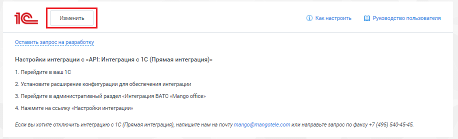
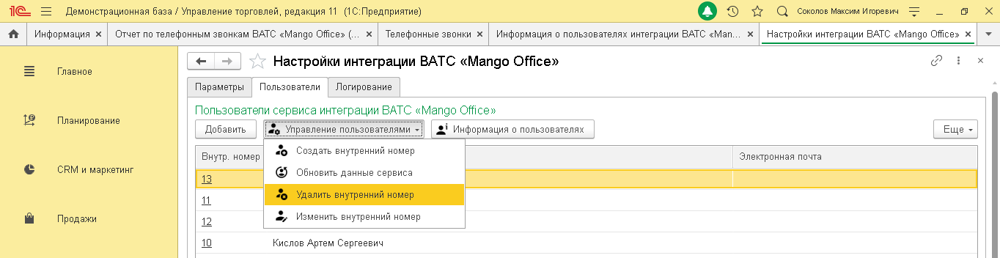
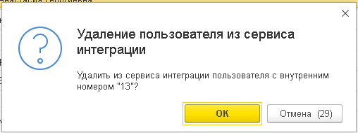

# 3.4. Управление пользователями интеграции 1С

> Трассировка: PDF §3.4 · сквозные стр. 25-29 · источники: ч.1 `kb/sources/integration_1c/Integratsiya_virtualnoy_ats_Pryamaya_integraciya_s_1C.pdf` с.25-29.

Информация о пользователях Чтобы открыть информацию о пользователях, нажмите на кнопку «Управление пользователями» на вкладке «Пользователи»:

Рисунок 35 Будет открыт список пользователей прямой интеграции с 1С. Вы можете сохранить список в

файл или распечатать его, кнопки в правом верхнем углу списка:

Рисунок 36 5Прямая интеграция с системой «1С: Управление торговлей» Редакция 11 (11.3 - 11.4, 11.5) | Версия от 22.12 .2025 Как добавить пользователя Управляйте количеством пользователей прямой интеграции 1С с Виртуальной АТС прямо из Личного кабинета MANGO OFFICE. Изменить количество пользователей интеграции можно в любое время. Чтобы изменить количество пользователей, выполните следующие действия: 1) откройте ваш Личный кабинет MANGO OFFICE; 2) перейдите в раздел «Интеграции»; 3) нажмите кнопку «Изменить» в блоке прямой интеграции с 1С:

Рисунок 37 4) укажите, сколько ваших сотрудников будут пользоваться интеграцией с 1С. Минимальное количество – 3 пользователя; 5) нажмите кнопку «Сохранить». Будет изменено количество пользователей прямой интеграции с 1С; 6) для новых пользователей интеграции нужно настроить сопоставление пользователей 1С и внутренних номеров Виртуальной АТС.

Рисунок 38 5Прямая интеграция с системой «1С: Управление торговлей» Редакция 11 (11.3 - 11.4, 11.5) | Версия от 22.12 .2025 Как изменить внутрениий номер ВАТС Для того, чтобы изменить у пользователя 1С внутренний номер ВАТС, выполните следующие действия: 1) перейдите в ваш 1С; 2) перейдите в административный раздел «Интеграция ВАТС «Mango office»; 3) нажмите на ссылку «Настройки интеграции»; 4) перейдите на вкладку «Пользователи» в открывшейся форме «Настройки интеграции ВАТС «MANGO OFFICE»; 5) дважды кликните на ячейку «Внутр. Номер» в строке с данными сотрудника; 6) введите внутренний номер вашей Виртуальной АТС и нажмите кнопку «Ок» в открывшейся форме:

Рисунок 39 5Прямая интеграция с системой «1С: Управление торговлей» Редакция 11 (11.3 - 11.4, 11.5) | Версия от 22.12 .2025 Удаление внутреннего номера Чтобы удалить внутренний номер у пользователя прямой интеграции с 1С, выполните следующие действия: 1) нажмите на кнопку «Управление пользователями» на вкладке «Пользователи»; 2) выберите пункт «Удалить внутренний номер»:

Рисунок 40 3) нажмите кнопку «Ок»:

Рисунок 41 5Прямая интеграция с системой «1С: Управление торговлей» Редакция 11 (11.3 - 11.4, 11.5) | Версия от 22.12 .2025
