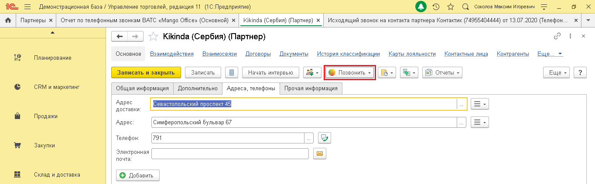
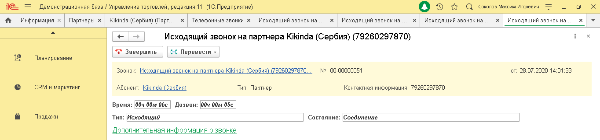

# 5.1. Звонок по клику

> Трассировка: PDF §5.1 · сквозные стр. 30-31 · источники: ч.1 `kb/sources/integration_1c/Integratsiya_virtualnoy_ats_Pryamaya_integraciya_s_1C.pdf` с.30-31.

Вы можете инициировать исходящий звонок из следующих элементов 1С: - карточка партнера; - карточка контактного лица; - список контактных лиц партнеров; - список партнеров; - список физических лиц; - карточка физического лица; - список контрагентов; - карточка контрагента; - документа «Телефонный звонок»; - список документов «Телефонный звонок».

При нажатии на кнопку , сначала зазвонит ваш рабочий телефон, и только после того как вы поднимете трубку – начнется звонок на выбранный номер телефона:

Рисунок 43 После того, как Клиент примет входящий звонок, в интерфейсе 1С будет показана карточка звонка, в которой будет показана информация о звонке. Чтобы завершить звонок, нужно

положить трубку рабочего телефона или нажать кнопку в карточке звонка: 5Прямая интеграция с системой «1С: Управление торговлей» Редакция 11 (11.3 - 11.4, 11.5) | Версия от 22.12 .2025

Рисунок 44

Примечание. Вы можете настроить стандартную кнопку вызова так, чтобы она инициировала исходящий звонок. Для этого нужно настроить конфигурацию модуля "УправлениеКонтактнойИнформациейКлиент".
