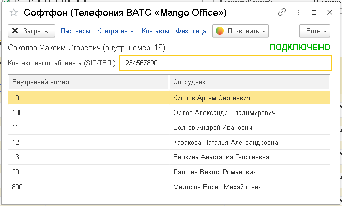

# 5.2. Софтфон

> Трассировка: PDF §5.2 · сквозные стр. 31-32 · источники: ч.1 `kb/sources/integration_1c/Integratsiya_virtualnoy_ats_Pryamaya_integraciya_s_1C.pdf` с.31-32.

Это встроенная функция прямой интеграции с 1С, при помощи которой вы можете набрать номер телефона и выполнить исходящий звонок Клиенту или сотруднику. Важно! Софтфон предназначен только для набора номера и поиска контактов в интерфейсе 1С. Чтобы слышать и разговаривать с собеседником используйте ваш рабочий SIP-телефон или бесплатный коммуникатор MANGO OFFICE. Чтобы позвонить при помощи софтфона, выполните следующие действия: 1) перейдите в раздел «Интеграция ВАТС «Mango office»; 2) нажмите на ссылку «Софтфон»; 3) введите номер телефона, на который нужно позвонить или выберите сотрудника, которому нужно позвонить;

4) нажмите кнопку . При нажатии этой кнопки, сначала зазвонит ваш рабочий телефон, и только после того как вы поднимете трубку – начнется звонок на выбранный номер телефона:

Рисунок 45 5Прямая интеграция с системой «1С: Управление торговлей» Редакция 11 (11.3 - 11.4, 11.5) | Версия от 22.12 .2025
