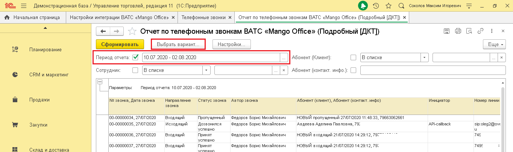
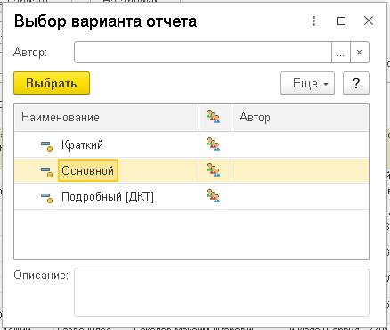
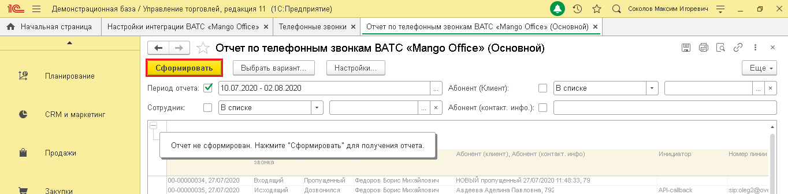
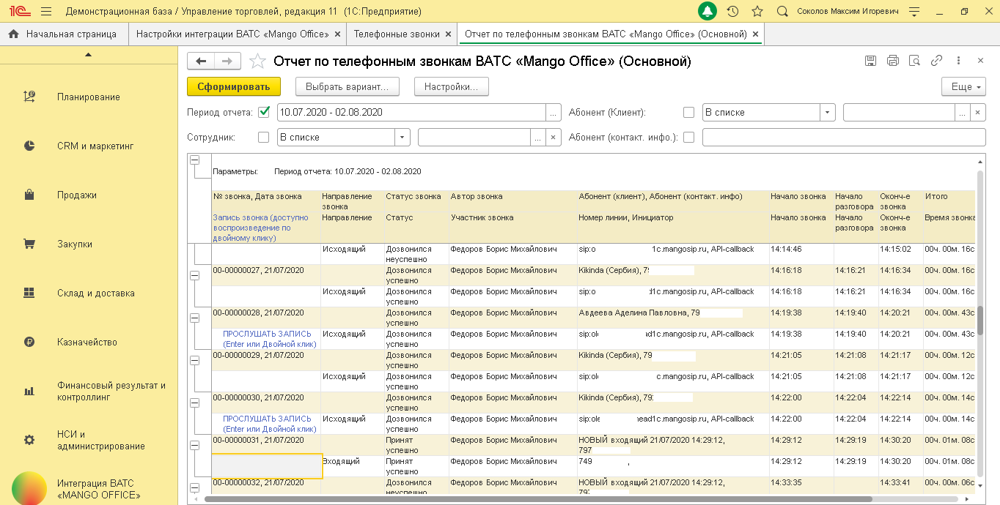
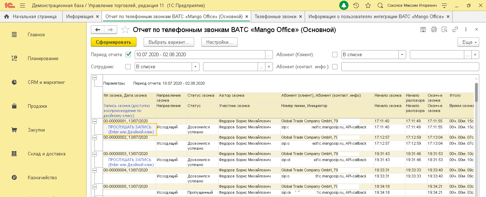

# 6.1. Отчет по телефонным звонкам ВАТС

> Трассировка: PDF §6.1 · сквозные стр. 32-36 · источники: ч.1 `kb/sources/integration_1c/Integratsiya_virtualnoy_ats_Pryamaya_integraciya_s_1C.pdf` с.32-36.

Это отчет в 1С, который отражает количество звонков, совершенных через вашу Виртуальную АТС «Mango office». Вы выбираете период и вариант отчета: краткий, основной, подробный (ДКТ). Как открыть отчет Для того, чтобы открыть отчет, выполните следующие действия: 1) перейдите в раздел «Интеграция ВАТС «Mango office»; 2) нажмите на ссылку «Отчет по телефонным звонкам»; 3) активируйте переключатель «Период отчета», затем выберите даты отчета; 4) нажмите кнопку «Выбрать вариант…»:

Рисунок 46 5) выберите вариант отчета; 6) нажмите кнопку «Выбрать»:

5Прямая интеграция с системой «1С: Управление торговлей» Редакция 11 (11.3 - 11.4, 11.5) | Версия от 22.12 .2025 Рисунок 47 7) нажмите кнопку «Сформировать»:

Рисунок 48 Будет выведен на экран отчет по телефонным звонкам ВАТС выбранного варианта:

Рисунок 49 Описание параметров отчета Отчет по телефонным звонкам состоит из следующих параметров:

| Параметр отчета | Пояснение | Варианты отчета |  |  |
| --- | --- | --- | --- | --- |
|  |  | Краткий | Основной | Подробный |
| № звонка, Дата звонка | Номер звонящего (если звонок входящий) или номер, на который звонил сотрудник (исходящий звонок), а также дата начала звонка. | + | + | + |
| Запись звонка | Ссылка на запись разговора. Опционально | - | + | - |
| Направление звонка | Направление вызова. Возможные значения: внутренний, исходящий, входящий | + | + | + |
| Статус звонка | Возможные значения: | + | + | + |

5Прямая интеграция с системой «1С: Управление торговлей» Редакция 11 (11.3 - 11.4, 11.5) | Версия от 22.12 .2025

| Параметр отчета | Пояснение | Варианты отчета |  |  |
| --- | --- | --- | --- | --- |
|  |  | Краткий | Основной | Подробный |
|  | - Пропущенный: входящий звонок был пропущен; - Принят успешно: входящий звонок, длительность которого строго больше N сек; - Принят не успешно: входящий звонок, длительность которого меньше или равно N сек; - Дозвонился успешно: исходящий звонок, длительность которого строго больше M сек; - Дозвонился не успешно: исходящий звонок, длительность которого меньше или равно M сек; - Переведен: звонок переведен |  |  |  |
| Автор звонка | Сотрудник, принявший звонок при входящем. Сотрудник, совершивший звонок при исходящем. Примечание. Под сотрудником нужно понимать пользователя 1С | + | + | + |
| Участник звонка | Кто принял вызов. Опционально | - | + | - |
| Абонент | Имя Клиента, если звонок привязан к Клиенту или имя контакта, если звонок привязан к контакту, нет ни одного Клиента, связанного с контактом | + | + | + |
| Инициатор | Инициатор звонка | + | + | + |
| Номер линии | DID-номер, на который звонил Клиент или SIP-адрес линии, на который звонил Клиент (в том числе для звонка с сайта) при входящем. Номер, через который звонил сотрудник при исходящем звонке | + | + | + |
| Начало звонка | Время начала звонка. | + | + | + |
| Начало разговора | Время начала разговора. | + | + | + |
| Окончание звонка | Время окончания звонка | + | + | + |
| Время звонка | Суммарная длительность звонка, от начала звонка до его завершения. | + | + | + |
| Время разговора | Суммарное время разговоров, либо 0, если разговора не было | + | + | + |

5Прямая интеграция с системой «1С: Управление торговлей» Редакция 11 (11.3 - 11.4, 11.5) | Версия от 22.12 .2025

| Параметр отчета | Пояснение | Варианты отчета |  |  |
| --- | --- | --- | --- | --- |
|  |  | Краткий | Основной | Подробный |
| Данные ДКТ | Данные коллтрекинга о посещении вашего сайта | - | - | + |

Воспроизведение записи разговора Чтобы прослушать запись разговора, в основном или подробном отчете по звонкам ВАТС дважды кликните по ссылке «Прослушать запись». Примечание. Если ссылка на запись разговора отсутствует, то значит разговор не состоялся либо не велась запись разговора по той или иной причине.

Рисунок 50 Начнется воспроизведение выбранной вами записи. Примечание. Воспроизведение записи разговора выполняется на медиапеере, ранее установленном на вашем ПК.

Рисунок 51 5Прямая интеграция с системой «1С: Управление торговлей» Редакция 11 (11.3 - 11.4, 11.5) | Версия от 22.12 .2025
