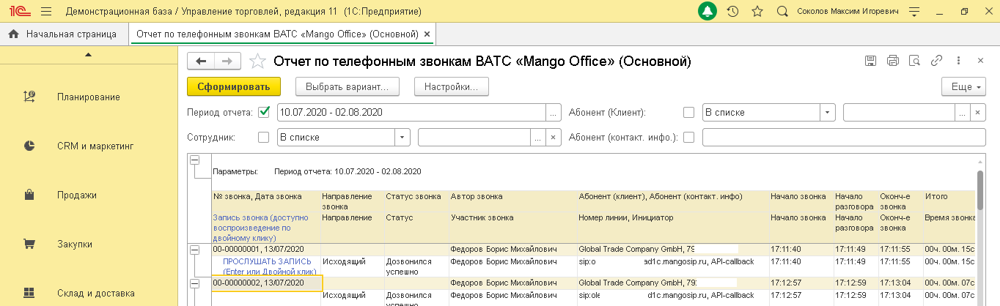
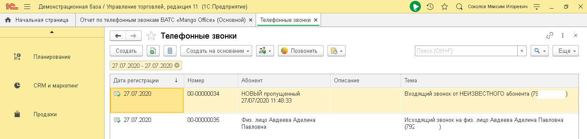

# 6.2. Карточка звонка

> Трассировка: PDF §6.2 · сквозные стр. 36-38 · источники: ч.1 `kb/sources/integration_1c/Integratsiya_virtualnoy_ats_Pryamaya_integraciya_s_1C.pdf` с.36-38.

Общие сведения Для каждого звонка в 1С автоматически создается отдельная карточка, в которой сохраняются подробные сведения о звонке, например, номер телефона, ФИО ответственного сотрудника и т.д. Вы можете в карточке звонка прослушать запись разговора, посмотреть данные коллтрекинга, прикрепить файл к карточке и многое другое. Информация в карточке звонка обновляется автоматически и вы сможете узнать, последние актуальные сведения. Как открыть отчет Чтобы открыть карточку звонка, дважды кликните по номеру звонка в отчете по звонкам ВАТС:

Рисунок 52 или в отчете «Телефонные звонки»:

Рисунок 53 В карточке звонка информация собрана на нескольких вкладках: 5Прямая интеграция с системой «1С: Управление торговлей» Редакция 11 (11.3 - 11.4, 11.5) | Версия от 22.12 .2025 - Основное; - Взаимодействие; - Задачи; - Мои заметки. На вкладке «Основное» отображаются основные сведения о звонке: 1) панель с элементами управления; 2) параметры звонка; 3) дополнительные вкладки: - Описание: внесите дополнительные сведения о звонке, при необходимости; - Комментарий: добавьте комментарий, при необходимости; - MANGO OFFICE: содержит 2 таблицы а) История звонка: запись разговора и информация звонке; б) Параметры ДКТ: данные коллтрекинга о посещении вашего сайта. Доступны, если в ВАТС подключен Коллтрекинг:

Рисунок 54 Взаимодействие – это контакты с Клиентом по различным каналам: телефон, смс, и т.д. На данной вкладке показана история контактов с Клиентом, зафиксированная в 1С: 5Прямая интеграция с системой «1С: Управление торговлей» Редакция 11 (11.3 - 11.4, 11.5) | Версия от 22.12 .2025

Рисунок 55
