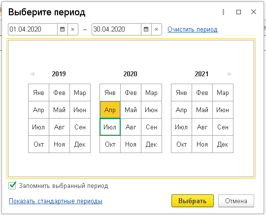
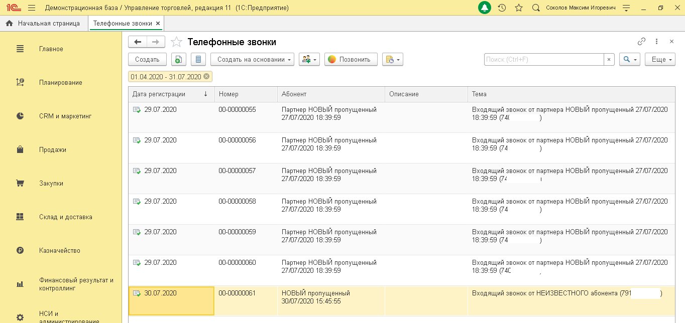

# 6.3. Отчет «Телефонные звонки»

> Трассировка: PDF §6.3 · сквозные стр. 38-40 · источники: ч.1 `kb/sources/integration_1c/Integratsiya_virtualnoy_ats_Pryamaya_integraciya_s_1C.pdf` с.38-40.

Отчет «Телефонные звонки» позволяет получить информацию о звонках пользователей через ВАТС MANGO OFFICE. В нем доступны следующие показатели: - дата регистрации звонка: - номер; - информация об абоненте или новом Клиенте; - описание, указанное в карточке Клиента; - тема. Чтобы открыть отчет в 1С, выполните: 1) перейдите в раздел «Интеграция ВАТС «Mango office»; 2) нажмите на ссылку «Телефонные звонки»; 3) нажмите кнопку, затем выберите пункт «Установить период»:

Рисунок 56 4) введите период отчета и нажмите кнопку «Выбрать»: 5Прямая интеграция с системой «1С: Управление торговлей» Редакция 11 (11.3 - 11.4, 11.5) | Версия от 22.12 .2025

Рисунок 57 На экране будет показан отчет за выбранный период:

Рисунок 58 Чтобы перезвонить по номеру, указанному в отчете, кликните по номеру, затем нажмите кнопку

. Чтобы открыть карточку звонка для просмотра более подробных сведений – дважды кликните по номеру. 5Прямая интеграция с системой «1С: Управление торговлей» Редакция 11 (11.3 - 11.4, 11.5) | Версия от 22.12 .2025
