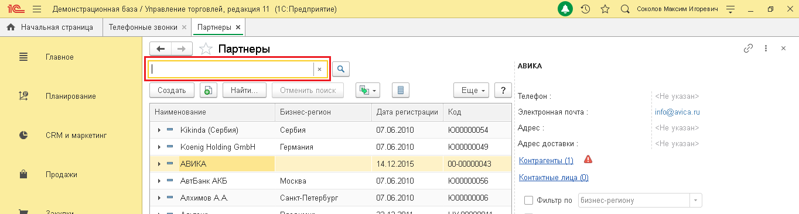
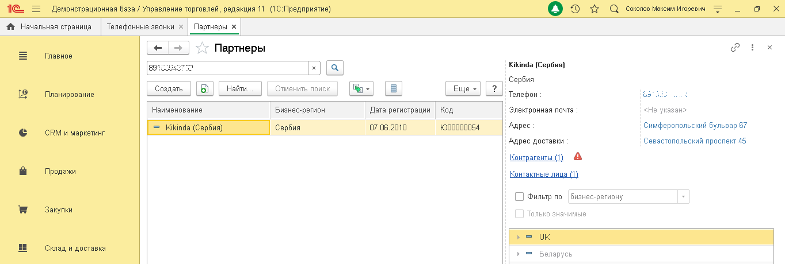

# 7.2. Поиск по номеру телефона

> Трассировка: PDF §7.2 · сквозные стр. 40-41 · источники: ч.1 `kb/sources/integration_1c/Integratsiya_virtualnoy_ats_Pryamaya_integraciya_s_1C.pdf` с.40-41.

Чтобы выполнить поиск абонента по номеру телефона, выполните следующие действия: 1) откройте справочник абонентов на нужном вам типе абонентов; 2) введите номер телефона и нажмите кнопку «Enter»:

Рисунок 60 Результаты поиска будут показаны в справочнике абонентов, при этом в правой части окна отображен список найденных абонентов, а в левой части – подробные сведения об абоненте. Чтобы открыть карточку абонента, нужно дважды кликнуть на строку с данными этого абонента. 5Прямая интеграция с системой «1С: Управление торговлей» Редакция 11 (11.3 - 11.4, 11.5) | Версия от 22.12 .2025

Рисунок 61
