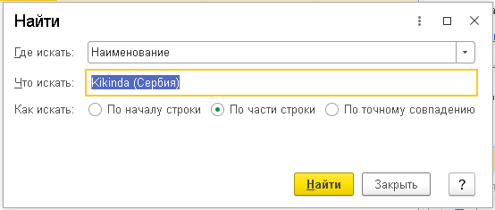

# 7.3. Поиск по параметрам абонента

> Трассировка: PDF §7.3 · сквозные стр. 41 · источники: ч.1 `kb/sources/integration_1c/Integratsiya_virtualnoy_ats_Pryamaya_integraciya_s_1C.pdf` с.41.

Поиск абонента в справочнике можно выполнять не только по номеру телефона, но и по следующим параметрам: - наименование; - бизнес-регион; - дата регистрации; - код. Чтобы выполнить поиск по любому из указанных параметров, нужно: 1) откройте справочник абонентов на нужном вам типе абонентов; 2) нажмите кнопку «Найти» в справочнике абонентов; 3) выберите параметр поиска в поле «Где искать»; 4) введите значение параметра в поле «Что искать»; 5) нажмите кнопку «Найти». Будет выполнен поиск абонента по указанным вами параметрам.

Рисунок 62
