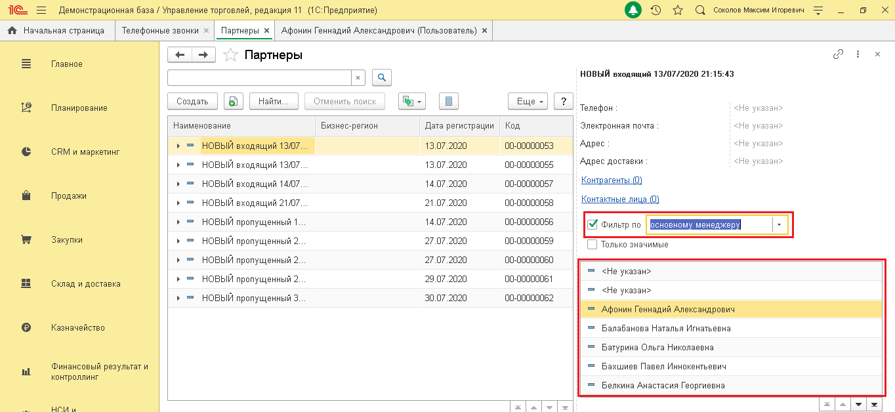

# 7.4. Фильтрация записей в справочнике

> Трассировка: PDF §7.4 · сквозные стр. 41-43 · источники: ч.1 `kb/sources/integration_1c/Integratsiya_virtualnoy_ats_Pryamaya_integraciya_s_1C.pdf` с.41-43.

Вы можете вывести на экран все записи справочника абонентов, в которых есть определенный параметр. Например, найти всех абонентов, привязанных к одному и тому же менеджеру. Вот как это сделать: 1) откройте справочник абонентов на нужном вам типе абонентов; 5Прямая интеграция с системой «1С: Управление торговлей» Редакция 11 (11.3 - 11.4, 11.5) | Версия от 22.12 .2025 2) активируйте переключатель «Фильтр по»; 3) выберите параметр фильтрации. В результате вы получите список информации об абонентах, соответствующих параметрам фильтрации.

Рисунок 63 5Прямая интеграция с системой «1С: Управление торговлей» Редакция 11 (11.3 - 11.4, 11.5) | Версия от 22.12 .2025
