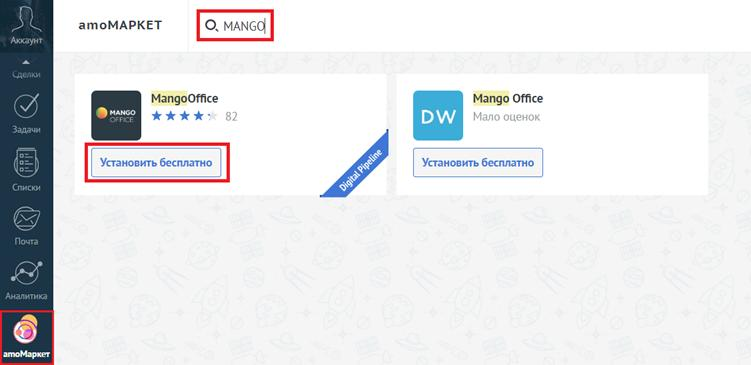
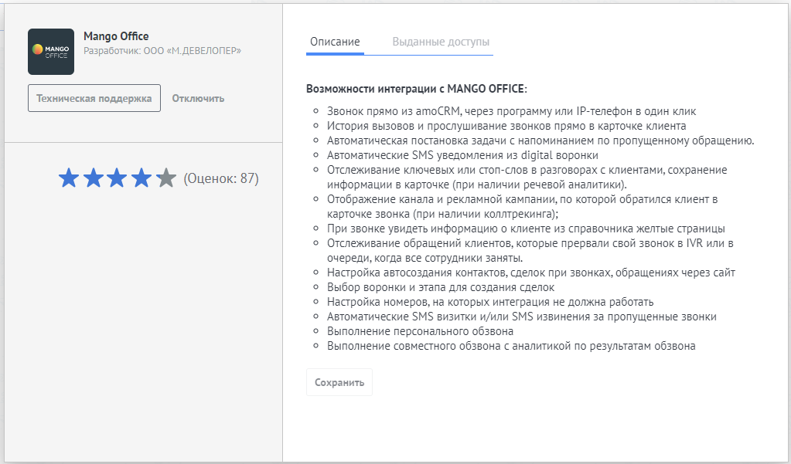

# Шаг 3. Установка виджета интеграции в amoCRM

> Трассировка: PDF §1 · сквозные стр. 6-8 · источники: ч.1 `kb/sources/integration_amocrm/Mango_office_integration_amoCRM.pdf` с.6-8.

Для этого необходимо: 1) войти в ваш amoCRM под учетной записью администратора; 2) перейти в раздел “amoМаркет”; 3) в поле “Поиск” введите значение “MangoOffice” и нажмите кнопку “Enter”; 4) в списке виджетов, найденных по вашему запросу, найдите виджет “MANGO OFFICE” (см. рисунок ниже) и нажмите кнопку “Установить бесплатно,” под ним. Примечание. Если в списке виджетов, найденных по вашему запросу, нет виджета “MANGO OFFICE” (такого как на рисунке ниже), то измените запрос: в поле “Поиск” вместо “MANGO OFFICE” введите значение “Mango Office” или “mango office”, или “MANGO”, или “OFFICE”. Интеграция Виртуальной АТС MANGO OFFICE и amoCRM | Версия от 25.08.2025

5) в открывшейся форме “MangoOffice” нужно установить “галочку” в поле “Согласен на передачу персональных данных…” и нажать на кнопку “Установить”:

Виджет установлен в amoCRM, при этом в форме “MangoOffice” показаны данные о виджете:

Интеграция Виртуальной АТС MANGO OFFICE и amoCRM | Версия от 25.08.2025
