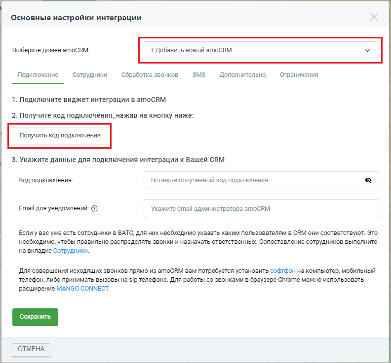
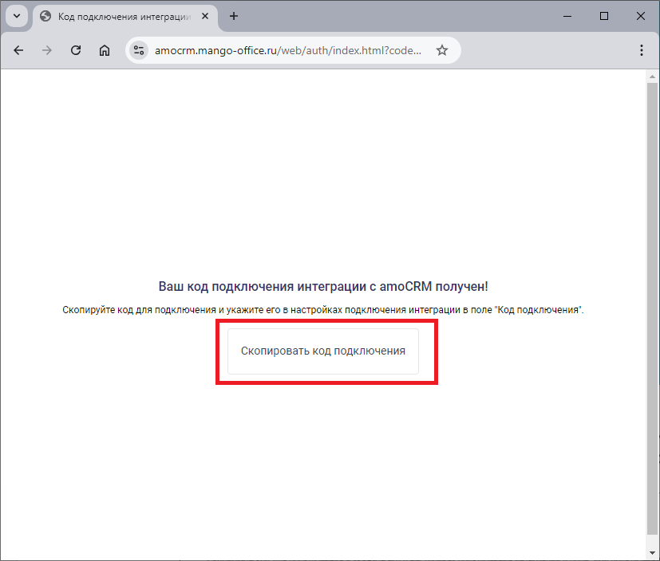
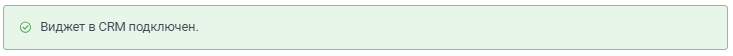

# Шаг 4. Настройка Виртуальной АТС. Выбор пакета интеграции

> Трассировка: PDF §1 · сквозные стр. 8-13 · источники: ч.1 `kb/sources/integration_amocrm/Mango_office_integration_amoCRM.pdf` с.8-13.

Это нужно сделать, чтобы Виртуальная АТС MANGO OFFICE могла передавать в вашу amoCRM данные о звонках. Для этого необходимо: 1) войти в Личный кабинет Виртуальной АТС; 2) выбрать вашу Виртуальную АТС, если у вас их несколько; 3) перейти в раздел “Интеграции”; 4) нажать на пункт “Подключить интеграцию”; 5) в блоке “amoCRM” нажать кнопку “Подробнее”:

6. будут выполнены следующие действия: – если у вас уже была подключена интеграция к Виртуальной АТС, то, после нажатия кнопки “Подробнее”, будет открыта страница “Мои интеграции”, на которой показан блок “amoCRM”; – если вы впервые подключаете интеграцию с amoCRM, то будет предложено выбрать пакет интеграции: базовая интеграция, пакет расширенный. Нажмите на пакет, который хотите подключить, затем нажмите на кнопку “Подключить”. Виджет интеграции будет подключен к вашей Виртуальной АТС и в Личном кабинете MANGO OFFICE на странице “Мои интеграции” будет показан блок “amoCRM”. Интеграция Виртуальной АТС MANGO OFFICE и amoCRM | Версия от 25.08.2025

7. нажмите на кнопку “Настроить” в блоке “amoCRM”;

8. проверьте, что в окне “Основные настройки интеграции” в поле “Выбрать домен amoCRM” указано значение “+ Добавить новый amoCRM”. Если в этом поле указано другое значение, значит надо в выпадающем списке “Выбрать домен amoCRM” выбрать значение “+Добавить новый amoCRM”; 9. нажмите кнопку “Получить код подключения”: Интеграция Виртуальной АТС MANGO OFFICE и amoCRM | Версия от 25.08.2025

10. будет открыта новая вкладка вашего браузера. На ней, если вы уже вошли в аккаунт AmoCRM, будет открыта форма для предоставления доступа виджету интеграции к вашему аккаунту amoCRM (см. рисунок ниже). В противном случае вам будет предложено авторизоваться в AmoCRM при помощи ваших логина и пароля, а затем будет открыта форма для предоставления доступа виджету интеграции к вашему аккаунту amoCRM; 11. в поле “Выберите аккаунт” выберите аккаунт AmoCRM, с которым будет настроена интеграция;

Интеграция Виртуальной АТС MANGO OFFICE и amoCRM | Версия от 25.08.2025 12. нажмите кнопку “Разрешить”, чтобы разрешить виджету интеграции доступ к вашему аккаунту AmoCRM;

13. будет создан код подключения интеграции с amoCRM, который вам необходимо скопировать. Для этого, нажмите кнопку “Скопировать код подключения”: Интеграция Виртуальной АТС MANGO OFFICE и amoCRM | Версия от 25.08.2025

14. в окне “Основные настройки интеграции” вставьте скопированный код в поле “Код подключения”; 15. в поле “Email для уведомлений” укажите электронную почту, на которую хотите получать уведомления от amoCRM; 16. нажмите на кнопку “Сохранить”:

17. если подключение виджета интеграции выполнено успешно, то будет выдано сообщение “Виджет в CRM подключен” (см. рисунок ниже). Иначе, будет выдано сообщение об ошибке, в этом случае проверьте, правильно ли выполнены пункты 1 - 16. Интеграция Виртуальной АТС MANGO OFFICE и amoCRM | Версия от 25.08.2025

