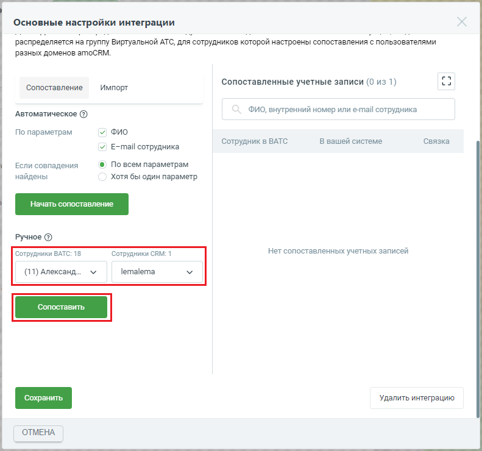
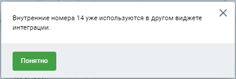

# Шаг 5. Сопоставление сотрудников Виртуальной АТС и amoCRM

> Трассировка: PDF §1 · сквозные стр. 13-18 · источники: ч.1 `kb/sources/integration_amocrm/Mango_office_integration_amoCRM.pdf` с.13-18.

Уважаемые абоненты! Без сопоставления сотрудников из личного кабинета MANGO OFFICE в виджете MANGO OFFICE в amoCRM интеграция работать не будет. Общее Важнейшей задачей интеграции является корректное распределение звонков между пользователями. Приложение интеграции хранит таблицу сопоставления сотрудников Виртуальной АТС с пользователями amoCRM, которую вы можете видеть в блоке “Сотрудники”. Эту таблицу составляете вы. В ней вы указываете какому сотруднику Виртуальной АТС соответствует сотрудник amoCRM. Когда пользователь, кликнув по номеру телефона в amoCRM, инициирует исходящий звонок отправку sms, приложение интеграции сравнивает данные этого пользователя с таблицей сопоставления сотрудников Виртуальной АТС с пользователями amoCRM. Если обнаруживается совпадение (пользователю amoCRM, инициировавшему звонок отправку sms, поставлен соответствующий сотрудник Виртуальной АТС), то звонок отправка sms выполняется от соответствующего сотрудника Виртуальной АТС. И наоборот, когда поступает входящий звонок от Клиента и Виртуальная АТС распределяет его на конкретного сотрудника, приложение интеграции сравнивает данные этого сотрудника с таблицей сопоставления. Если обнаруживается совпадение, то звонок направляется на соответствующего пользователя amoCRM. Обратите внимание. Если вы указали не всех менеджеров в таблице сопоставления сотрудников, а также, если вы хотите фиксировать звонки сотрудников, которые не работают в amoCRM, но могут звонить клиентам (например, бухгалтер, курьер и т.д.), то вы можете включить настройку “Сохранять все звонки” и указать в ней нужного сотрудника amoCRM. Тогда к этому сотруднику будут автоматически привязываться разговоры с Клиентами сотрудников, не указанных в таблице сопоставления. Эта настройка доступна только в расширенном пакете интеграции. Ограничения для сопоставления сотрудников 1) Запрещается одного и того же сотрудника amoCRM указывать более чем в одном виджете интеграции; 2) Чтобы виджет интеграции корректно распределял звонки, в настройках виджета интеграции не рекомендуется указывать сотрудника Виртуальной АТС, состоящего в группе, участники которой настроены в другом виджете интеграции (зарегистрированы в другом домене amoCRM). 3) Запрещается одному сотруднику Виртуальной АТС ставить в соответствие нескольких пользователей amoCRM. Если в настройке сопоставления сотрудника вами выбран сотрудник Виртуальной АТС, ранее указанный в настройках другого вашего виджета интеграции, будет выдано сообщение об ошибке. Интеграция Виртуальной АТС MANGO OFFICE и amoCRM | Версия от 25.08.2025 Как настроить сопоставление сотрудников Вариант 1. Вручную Если вы хотите настроить сопоставление сотрудников amoCRM и Виртуальной АТС вручную, выполните: 1) убедитесь, что вы зарегистрировали всех нужных сотрудников в обоих системах; 2) перейдите в окно “Основные настройки интеграции”, проверьте что открыта вкладка “Сотрудники” 3) проверьте что нажата кнопку “Сопоставление”; 4) прокрутите окно колесиком мыши, чтобы было видно блок “Ручное”;

5) укажите пару сотрудник ВАТС-сотрудник CRM в поле “Ручное”; 6) нажмите кнопку “Сопоставить”; Интеграция Виртуальной АТС MANGO OFFICE и amoCRM | Версия от 25.08.2025

Будет выполнена проверка возможности сопоставления указанных вами сотрудников. Если проверка пройдена успешно, будет выдано сообщение “Пара сопоставлена и добавлена в список”:

Если сотрудников нельзя сопоставить, будет выдано сообщение об ошибке. Вам нужно нажать кнопку “Ок” в сообщении об ошибке, затем укажите других сотрудников в настройке сопоставления.

7) настройте сопоставление всех нужных вам сотрудников ВАТС и amoCRM, повторив шаги 5 и 6; 8) после сопоставления сотрудников обязательно сохраните настройки интеграции, нажав кнопку “Сохранить” Примечание. Если группа полей “Ручное” не отображается, значит ранее она была скрыта.

Нажмите на кнопку , чтобы эта группа полей вновь отобразилась на экране. Интеграция Виртуальной АТС MANGO OFFICE и amoCRM | Версия от 25.08.2025

Вариант 2. Автоматически Функция автоматического сопоставления сотрудников сравнивает ФИО иe-mail сотрудников и составляет список совпадающих сотрудников. Важно! Учтите, что автоматическое сопоставление требует, чтобы ФИО и email сотрудников были записаны одинаково в вашем amoCRM и в Виртуальной АТС. Если появится сообщение “Пары для сопоставления не найдены”, убедитесь, что ФИО и e-mail сотрудников записаны в вашем amoCRM и Виртуальной АТС одинаково. Чтобы автоматически сопоставить сотрудников, выполните следующие действия 1) убедитесь, что вы зарегистрировали всех нужных сотрудников в обоих системах; 2) перейдите в окно “Основные настройки интеграции”, проверьте что открыта вкладка “Сотрудники” 3) проверьте что нажата кнопку “Сопоставление”; 4) в группе полей “Автоматическое”: выберите параметры для сопоставления: ФИО, E-mail; 5) выберите режим сопоставления: по всем параметрам (точное совпадение) или хотя бы по одному параметру; 6) нажмите кнопку “Начать сопоставление”. Интеграция Виртуальной АТС MANGO OFFICE и amoCRM | Версия от 25.08.2025

7) В результате в поле “Сопоставленные учетные записи” будет показан список пар сотрудник ВАТС-сотрудник CRM, либо выдано сообщение “Пары для сопоставления не найдены”; 8) прокрутите окно “Основные настройки интеграции” вниз до конца, чтобы появилась кнопка “Сохранить”. Нажмите на эту кнопку.

Интеграция Виртуальной АТС MANGO OFFICE и amoCRM | Версия от 25.08.2025 Примечание. Если группа полей “Автоматическое” не отображается (см. рисунок ниже), значит

ранее она была скрыта. Нажмите на кнопку , чтобы группа полей “Автоматическое” вновь отобразилась на экране. Как сохранять все звонки в amoCRM. Обобщенно По умолчанию, виджет интеграции сохраняет в amoCRM данные о звонках только “сопоставленных” сотрудников, то есть сотрудников, указанных в таблице сопоставления. При этом, звонки “не сопоставленных сотрудников” не сохраняются. Вы можете поменять эту настройку, при подключении расширенного пакета интеграции. Вы можете включить настройку “Сохранять все звонки” и указать нужного вам сотрудника. Тогда все разговоры сотрудников в Клиентами будут сохранятся в amoCRM. Перед тем как включать данную настройку, узнайте больше о принципе ее работы в параграфе “Настройка “Сохранять все звонки” или как сохраняются звонки сотрудников, не указанных в таблице сопоставления”. Как удалить пару сотрудник ВАТС-сотрудник CRM В поле “Сопоставленные учетные записи” вы можете удалить любую пару поле “Сопоставленные учетные записи”. Наведите курсор на строку с данными нужной пары, появится иконка в столбце “Связка”. Нажмите на нее. Выбранная пара будет удалена.

Прокрутите окно “Основные настройки интеграции” вниз до конца, чтобы появилась кнопка “Сохранить”. Нажмите на эту кнопку.
