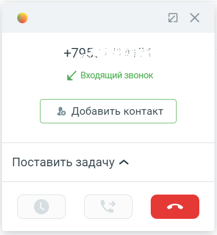

# Как позвонить или принять звонок

> Трассировка: PDF §1 · сквозные стр. 20-22 · источники: ч.1 `kb/sources/integration_amocrm/Mango_office_integration_amoCRM.pdf` с.20-22.

Чтобы позвонить Клиенту, продавец может кликнуть на номер телефона в amoCRM. Откроется выпадающее меню, в котором выберите пункт “Позвонить MANGO OFFICE”:

или набрать его на экранной клавиатуре Mango Talker и нажать кнопку “Вызов”. В amoCRM будет показана карточка исходящего звонка. При этом, если сотрудник кликнул на номер телефона в amoCRM, то сначала зазвонит его Mango Talker, и только после того как сотрудник примет звонок – начнется звонок на выбранный номер телефона. При входящем звонке у сотрудника зазвонит Mango Talker (указанный в карточке сотрудника в Личном кабинете в качестве средства приема вызова), а в amoCRM покажется карточка звонка (в зависимости от дополнительных настроек интеграции внешний вид, а также отображение карточки звонка отличаются): Интеграция Виртуальной АТС MANGO OFFICE и amoCRM | Версия от 25.08.2025

Закрытие карточки звонка в amoCRM не завершает разговор. Чтобы завершить разговор нужно нажать кнопку “Завершить вызов” (если вы используете Mango Talker), либо нажать кнопку

в карточке звонка. После завершения звонка, в зависимости от дополнительных настроек интеграции, в amoCRM будет создан контакт, либо сделка, либо звонок будет зафиксирован в категории “НЕРАЗОБРАННОЕ”. Интеграция Виртуальной АТС MANGO OFFICE и amoCRM | Версия от 25.08.2025
