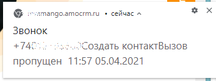

# 2.1. Включение уведомлений в браузере

> Трассировка: PDF §2.1 · сквозные стр. 22-23 · источники: ч.1 `kb/sources/integration_amocrm/Mango_office_integration_amoCRM.pdf` с.22-23.

Можно получать уведомления о пропущенных звонках и прочих событиях прямо на вашем компьютере, в браузере Google Chrome, Opera, Firefox, Safari. Для этого, должно быть открыто окно браузера, в котором выполнен вход в amoCRM. К примеру, уведомление о создании новой заявки в браузере Google Chrome выглядит так:

Важно! Уведомления не будут приходить, если в браузере запрещен показ всплывающих окон и/или включено блокирование рекламы. Чтобы включить показ уведомлений amoCRM на вашем компьютере, нужно включить показ всплывающих окон в вашем браузере: Google Chrome (подробнее..), Opera (подробнее…), Firefox (подробнее…). Чтобы более гибко настроить показ уведомлений в браузере, необходимо: 1) открыть ваш профиль пользователя amoCRM. Будет открыта страница “Настройки профиля”; 2) в блоке “Настройки уведомлений” нужно: - установить флаг “Браузер” (если он был выключен); - установить флаги в стройках тех событий, о которых нужно получать уведомления; 3) нажать кнопку “Сохранить” вверху окна “Настройки профиля”: Интеграция Виртуальной АТС MANGO OFFICE и amoCRM | Версия от 25.08.2025

