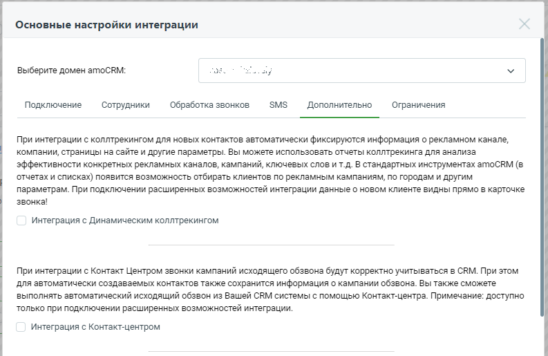
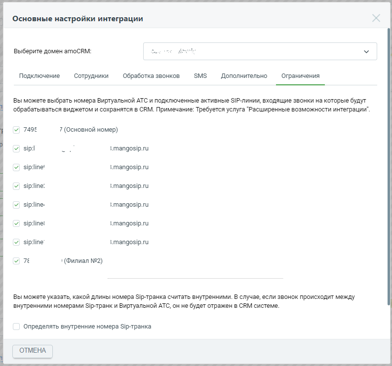

# 2.2. Дополнительные настройки интеграции. Обзор

> Трассировка: PDF §2.2 · сквозные стр. 23-25 · источники: ч.1 `kb/sources/integration_amocrm/Mango_office_integration_amoCRM.pdf` с.23-25.

В зависимости от ваших задач можно указать дополнительные настройки интеграции. На вкладке “Обработка звонков” настраивается логика обработки звонков – нужно ли автоматически создавать контакт или создавать в “неразобранном”, нужно ли ставить задачи по пропущенным звонкам и т.д.: , Контакт-центром, Digital-воронкой amoCRM, Речевой аналитикой:

На вкладке “Ограничения” указывается, для каких линий Виртуальной АТС работает интеграция с amoCRM Интеграция Виртуальной АТС MANGO OFFICE и amoCRM | Версия от 25.08.2025

